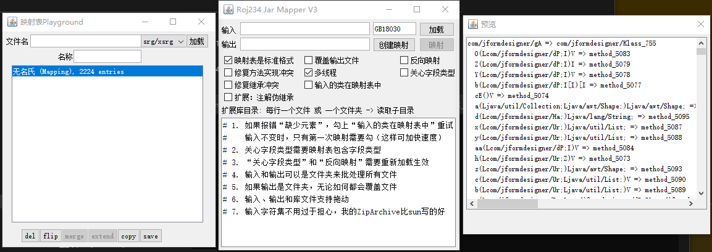

## RojLib v3
> v3.0版本进行了模块化改造，虽然core模块依然耦合严重，但体积-50%了  
> 自v.3.0起，本项目必须使用toolchain模块编译  
> 众所周知，好吧并非如此，由于我的toolchain不会在用户文件夹里拉屎  
> 所以懒得做软硬链接的我就在项目里塞了其他一堆东西（你可以通过.gitignore窥探到一些），所以我也没把编译配置放在它们本应该在的地方  
> 我会尽快出编译教程2.0版

# 目录
> 以下是我觉得值得一提的东西，按字母顺序（以及我的喜好）排序
### roj.compiler Lava程序语言
* 当前版本 1.0.4-alpha
* [文档](docs/Re_Lavac.md) &nbsp; [命令行入口](core/java/roj/compiler/Lavac.java) &nbsp; [嵌入代码使用](app/java/roj/plugins/dpiProxy/DPIProxy.java)

教程：
* [在家自制编译器·第一章 (WIP)](docs/hbc/part1.md)

### roj.archive  压缩包
[读写ZIP](core/java/roj/archive/zip/ZipArchive.java)&nbsp;
[新建ZIP](core/java/roj/archive/zip/ZipFileWriter.java)
* 任意编码 AES加密/ZipCrypto加密 分卷 增量修改 可开关仅读取CEN(更快) 复制数据
* 复制数据的意思是，可以从别人压缩好的文件中直接复制数据，不需要解压并重新压缩，这可以大大提升性能
* Info-ZIP UnicodePath和NTFS高精度时间戳(现已加入可写入豪华午餐)

[多线程高性能7z压缩和解压(文档)](docs/Re_QZArchiver.md)  
[读取/追加 7z](ext/7z-archive/java/roj/archive/qz/QZArchive.java)&nbsp;
[修改 7z](ext/7z-archive/java/roj/archive/qz/QZFileWriter.java)  
[方便增量修改的特制分卷压缩格式](ext/7z-archive/java/roj/archive/qz/util/QIncrementPak.java)
* 支持 AES加密 分卷 固实 压缩文件头 并行 BCJ BCJ2 增量修改 复制数据
* 全新* 的并行压缩方式！既支持文件级别的并行压缩，又支持单个文件的并行压缩（LZMA2 only）
* 高性能，某些时候甚至比7-zip更快

### roj.asm  字节码处理
    自己做的ASM, 资料来自VM规范  
    不支持的项目：
      内容（方法内部的）注解
      计算StackMapTable (部分不支持, 依赖编译器)
    性能、内存占用、易用性（至少对我来说）均优于ow的asm

主要特点为按需解析，所以速度快，内存用的少，我用了都说好  
[按需解析的字节码处理框架，100%原创](core/java/roj/asm/package-info.java)
* [基于它的高性能事件系统](core/java/roj/asmx/event/EventBus.java) 设计模式抄的Forge 支持取消、继承、泛型
* [伪LaunchWrapper](core/java/roj/asmx/launcher/Loader.java) 对字节码进行转换
* [类映射器](core/java/roj/asmx/mapper/Mapper.java) 编译模组必须的
* * by using this framework, 它的速度是SpecialSource的十倍 _(2023/2/11更新:更快了)_
* [公共注解缓存](core/java/roj/asmx/AnnotationRepo.java) 还能保存到文件(二进制)，灵感来自forge1.12.2的时候那个半吊子注解缓存
* [类转换器管理器](core/java/roj/asmx/ConstantPoolHooks.java)
* * 比起遍历转换器列表，它可以单点注册转换器需要转换的类、甚至引用某个类，或具有注解

#### 图片展示


#### nixim
* 使用注解注入一个class，修改其中一些方法，或者让它实现接口
* 在头部、尾部、或中间插入你的代码
* 删除或替换方法
* 通过模糊匹配替换一个连续（不包含if、switch、循环）的代码段
* 替换常量的值，或将其的求值语句替换成一个函数
* 替换方法的调用
* 灵感来自spongepowered:mixin
* 现已增加Javadoc, 你可以在roj.asmx.injector包中查看各个注解的使用说明


### roj.collect  集合
* [一种全文搜索算法](core/java/roj/collect/MatchMap.java) &nbsp;
  [以及它的文档](docs/Re_MatchMap.md)
* [带压缩的字典树](core/java/roj/collect/TrieTree.java)
* [计算区间的交集](core/java/roj/collect/IntervalPartition.java)  
  可以用来计算变量的作用域  或者合并相邻数据的IO操作  
  ZipArchive有用到
* [环形缓冲区](core/java/roj/collect/RingBuffer.java)
* [砷铋的闭合寻址哈希表：无额外开销版](core/java/roj/collect/XashMap.java)
* [基于上面这个搞的怪东西](core/java/roj/collect/WeakCache.java)
* [get，put，remove开销均为常数的LFU缓存](core/java/roj/collect/LFUCache.java)

### roj.concurrent  并行
* [Promise都写好了才发现Java居然有](core/java/roj/concurrent/Promise.java)
* [基于时间轮的，所有操作耗时均为O(1)的定时任务系统](core/java/roj/concurrent/Timer.java)
* * 有锁，如果不要求删除为O(1)可以做到定义上无锁
* [Stream青春版](core/java/roj/util/function/Flow.java) 参考自腾讯云的一篇文章

### roj.config  配置
JSON YAML TOML INI XML NBT MSGPACK Torrent(Bencode) CSV Xlsx 解析器
* [入口](core/java/roj/config/ConfigMaster.java)
* 自动识别编码（仅支持中英，默认开启可关闭）
* 所有配置类型（除xml）使用[统一结构](core/java/roj/config/node/ConfigValue.java)
* 访问者模式(流式)的读取和写入（仅支持JSON YAML NBT MSGPACK）
* 支持dot-get: 形如`a.b[2].c` [CEntry](core/java/roj/config/node/ConfigValue.java)#query
* XML支持XPath-like查询语法 [Node](core/java/roj/config/node/xml/Node.java)#querySelector
* 支持Xlsx和Csv的流式读写，它们在[这里](core/java/roj/config/table)
* 人性化的错误提示
* [(几乎)任意对象和配置文件的自动序列化](docs/Re_SerializerFactory.md)

#### 人性化的错误(仅适用于等宽字体)
```  
解析错误:  
  Line 39: "最大线程数": 96, , ,  
-------------------------------------^  
总偏移量: 773  
对象位置: $.通用.  
原因: 未预料的: ,  
  
at roj.config.Tokenizer.err(Tokenizer.java:967)  
...
```

### roj.crypt  密码学
* [JAR签名和验证，自己做的ASN1读写](core/java/roj/crypt/jar/JarVerifier.java)
* [RS纠错码](core/java/roj/crypt/ReedSolomonECC.java)
* [高效随机抽样](core/java/roj/crypt/FPE.java)
* * 打乱一个长度小于2^256的数组，仅仅需要O(log n)的额外内存！这是非常节约内存的算法！
* * 本算法生成不重复的随机数组仅需O(log n)的空间复杂度，而常规算法（如Knuth Shuffle）需要O(n)的额外空间。
* * 这使得它特别适合对大规模数据集进行随机抽样。

### roj.ebook  电子书
* [EpubWriter](ext/ebook/java/roj/ebook/EpubWriter.java)

### roj.gui 图形界面
* [这个包](app/java/roj/gui/impl)里面包含了一些可以直接运行的用户界面

### roj.http 客户端和服务器
* 支持[HTTP2](http/java/roj/http/h2) 长连接 压缩缓存 错误友好 Websocket
* TLS1.3由于我想自己写所以还没做好
* [服务器](http-server/java/roj/http/server/HttpServer11.java)
* [注解定义的路由(文档)](docs/Re_OKRouter.md)&nbsp;&nbsp;
  [OKRouter(代码)](http-server/java/roj/http/server/auto/OKRouter.java)

### roj.io
* [内存分配器](core/java/roj/util/Bitmap.java)
* [灵活备份删除策略](core/java/roj/io/FlexibleRetiringPolicy.java)
* [Minecraft的Region格式](core/java/roj/io/RegionFile.java)

### roj.math
* [可变大整数(exposed)](core/java/roj/math/MutableBigInteger.java)
* [定点小数](core/java/roj/math/FixedDecimal.java)
* [128位整数](core/java/roj/math/S128i.java)
* [更好的Stitcher](ext/renderer/java/roj/renderer/util/Stitcher.java)
* [解方程](core/java/roj/math/MathUtils.java)

### roj.net 网络请求管线
[My Secure Socket](tls/java/roj/net/mss/MSSEngine.java)  
jvav的SSL不好用，自用的话还不如自己写一个协议
* [x] 加密方式协商
* [x] 前向安全
* [x] 0-RTT

### roj.plugin 插件管理系统
* 特点： 交互式终端 命令补全 HTTP服务器 热重载 依赖注入 声明式权限管理 依赖管理 生命周期管理  
  [(并不)安全的插件系统](docs/Re_PluginSystem.md)
* [插件列表](app/java/roj/plugins)

### roj.ci 持续集成？ MCMake
* 模组、插件和普通Java项目开发工具
* 2019年，有着Minecraft开发的需求, 和ForgeGradle那惊人的缓慢，还有编译要联网什么的，我决定制作它
* 不联网 体积小 速度快
* 增量编译 自动编译 热重载 屏蔽警告 （java8的时候那种使用Unsafe的警告，能按错误码屏蔽）
* 多版本 多项目 支持MIXIN 支持AT 支持NIXIM（上面提过我的项目）
* 支持项目依赖 自定义构建 变量替换 Maven 等等等等
* 大量自定义注解
* 不在用户文件夹拉屎
* 支持没有任何开发工具支持的子类实现重映射，这个bug直到2025年还在1.19.2最后一个版本的灾变模组里出现！
* * 它在编译期是无法被发现的
* * 我的映射器能自动发现并修复它，详情看[这里(代码)](core/java/roj/asmx/mapper/Mapper.java)#S2_3_FixSubImpl


### roj.plugins 插件
* [DDNS更新器](app/java/roj/plugins/ddns/DDNSClient.java) 支持阿里云，DynV6，甚至tracker
* [优化40系以前台式机显卡功耗](app/java/roj/plugins/CardSleep.java)
* [安全密码生成器](app/java/roj/plugins/MyPassIs.java)
* [Websocket shell](app/java/roj/plugins/Websocketd.java)
* [简单的单点登录系统](plugin/sso/java/roj/plugins/web/sso/SSOPlugin.java)
* [为插件系统增加PHP支持, 还有FPM](app/java/roj/plugins/web/php/PHPPlugin.java)
* [部分实现了1.19.2的Minecraft服务端协议](app/java/roj/plugins/minecraft/server/MinecraftServer.java)
* [解压并导出asar、har或小红车的壁纸包](app/java/roj/plugins/unpacker/Unpacker.java)
* [带或不带中转服务器的端口转发程序(重构中，WIP)](app/java/roj/plugins/frp/MyFRP.java)
* * 客户端与服务器均能自签证书（用户ID）
* * 中转服务器模式下支持多个房间(主机)并行
* * 
* [小说校对工具](ext/ebook/java/roj/ebook/gui/NovelFrame.java)
  
* [NAT打洞(文档)](docs/Re_NAT.md) &nbsp; [代码](ext/p2p/java/roj/plugins/p2p/UPnPGateway.java)
* [基于DP的中音英混合搜索](ext/pinyin/java/roj/text/pinyin/TextSearchEngine.java) 参考text-search-engine (JavaScript)

### roj.reflect 反射
* [Java8-21通杀的高性能反射解决方案](docs/Re_Bypass.md) *现已兼容Java22
* [获取调用者的实例，是对象！](core/java/roj/reflect/GetCallerInstance.java)
* [把jdk.internal.misc.Unsafe的好方法(不对齐访问)暴露出来](core/java/roj/reflect/Unaligned.java)
* [动态生成的类和插件系统类卸载建通所需的‘虚引用’](core/java/roj/reflect/VirtualReference.java)
* * 通过修改GC Root的方式，让动态生成的类能且仅能在插件的类被卸载时卸载，并且几乎没有额外开销
* [在Java中直接使用机器码（汇编）或者无开销调用本机方法](core/java/roj/reflect/litasm/Intrinsics.java)

### roj.sql 数据库操作
* [从PHP搬过来的简易连接池和链式查询](ext/sql/java/roj/sql/QueryBuilder.java)
* [连接池](ext/sql/java/roj/sql/ConnectionPool.java)
* [注解定义的DataAccessObject](docs/Re_DAOMaker.md)

### roj.text 文本处理
* [简易日志记录器](core/java/roj/text/logging/Logger.java)
* [自动识别中文编码](docs/Re_ChineseCharset.md)
* [快速浮点解析](core/java/roj/text/FastDoubleParser.java)
* [快速字符串编解码](core/java/roj/text/FastCharset.java)
* [直接操作long的日期解析](core/java/roj/text/DateFormat.java)

### roj.ui 命令行界面
    请在支持虚拟终端转义序列的Console中执行 （在windows上可能需要libcpp.dll）
* [支持指令补全的终端模拟器](docs/Re_CommandConsole.md)  基于虚拟终端序列的终端模拟器
* [声明式命令](core/java/roj/ui/CommandNode.java)
* [支持同时出现多个的ANSI进度条](core/java/roj/ui/EasyProgressBar.java) 还带ETA

### roj.util 实用
* [对结构体进行排序](core/java/roj/util/Multisort.java)
* [BsDiff](ext/ebook/java/roj/text/diff/BsDiff.java)
* [本机内存](core/java/roj/util/NativeMemory.java)
* [共享内存](core/java/roj/util/SharedMemory.java)
* [更好的ByteBuffer](core/java/roj/util/DynByteBuf.java) 能扩展，也许Streamed，可作为Input/OutputStream, DataInput/Output

# Properties
int roj.nativeDisableBit [禁用native优化] (RojLib)
int roj.cpuPoolSize [CPU Count]  (TaskPool)  
String roj.text.outputCharset [UTF-8]  (TextWriter)  
Path roj.archiver.temp [.]  (ArchiverUI)  
File roj.lavac.i18n [null]  (Lava Compiler)  
boolean roj.debug.dumpClass  (ClassDefiner)
Path roj.compiler.symbolCache [.lavaCache]
Enum<enable, disable, legacy> roj.tty [enable]
boolean roj.config.noRawCheck


# Libcpp.dll
Windows：
* 共享内存 重用端口 ANSI终端转义
* [Fast LZMA2](https://github.com/conor42/fast-lzma2) (WIP)

公共：
* AES-NI BsDiff XXHash

如果有人问，你为什么不给Linux做优化？  
因为没有人问 ×

# 特别鸣谢
DeepSeek
* S128i的基础结构
* RS纠错码的部分重构
* 名称标准化的大部分建议
* 大量Javadoc
* 部分前端页面
* 从9月开始的一些commit message

JFormDesigner
* 让我不用碰恶心的AWT界面

STM32F10X
* 让我意识到C语言多么简单

@huige233
* 提供了很多梗图
* 提供了子模块的命名建议
* 提供了一些乱七八糟还被我真的实现了的需求
* 在我学会用IDA之前提供了一些Assembler中的opcode

黄豆
* 为7z压缩GUI提供了设计建议
* 找到了一些bug
* 给我的硬盘增加了许多写入量
* 为Lava语言提供了有关【无符号数据类型】的建议

ETC
* 提供EpubWriter的新模板
* 汇报EpubWriter的bug

CraftKuro
* 帮助安装和配置OpenWRT
* 提供情绪价值（吉祥物 ×）
* 提供Kuropack的命名（其实是我硬要贴上去的）
* 提供部分文本
* 试玩游戏

咖喱人
* 提供很多很多支持 (真的)
* 提供编程天赋 (雾, 但大概也是真的)