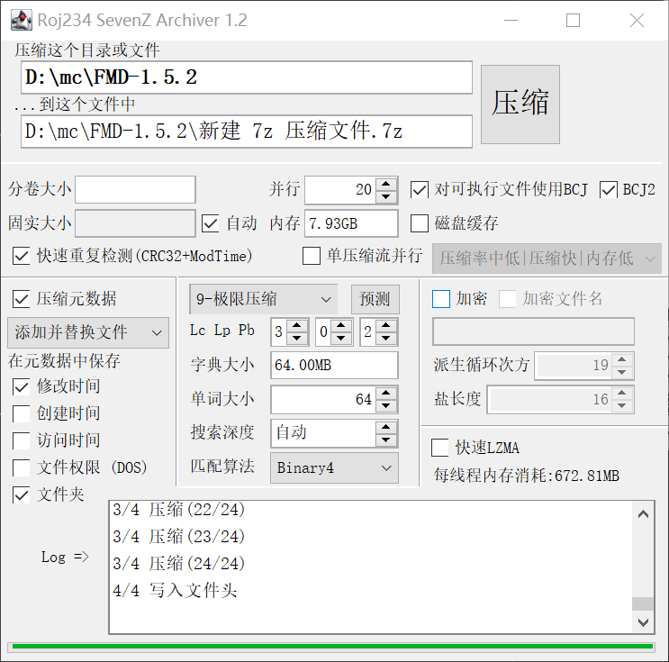
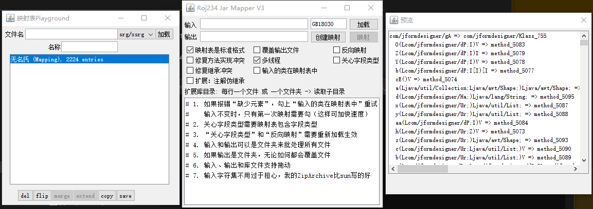
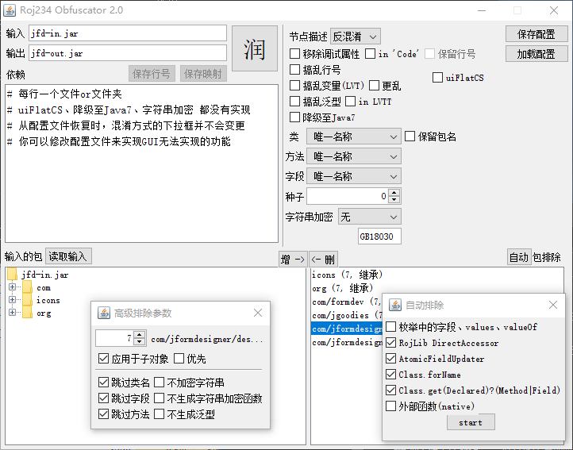
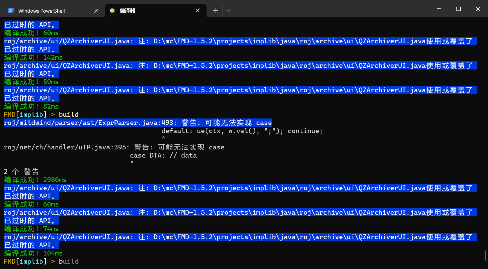
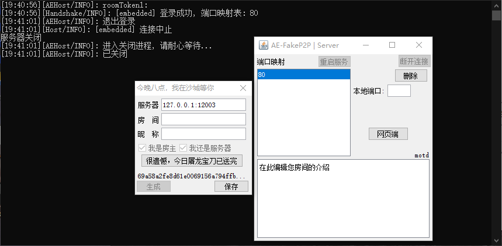
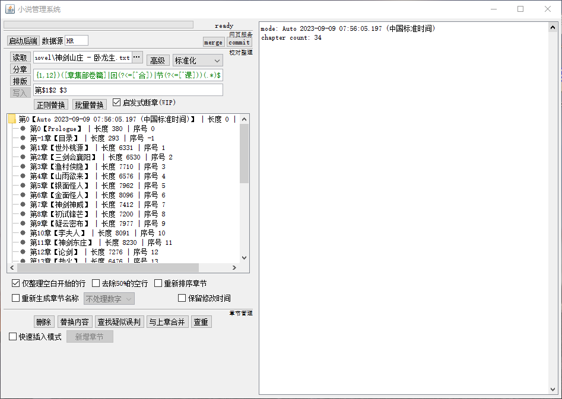

### 本项目存在大量无意留下的漏洞，仅供学习研究用途，如用作商业行为，不提供任何保证

### (Module level) TODO LIST
* [ ] yield
* [ ] java compiler
* [ ] javascript interpreter
* [ ] data flow analyze for bytecode
* [ ] retransform based advanced hot-reload
* [ ] server-side template language for web server

# 这里都有啥
## roj.archive
`ZipArchive/ZipFileWriter`: zip
* 读写
* 任意编码
* AES加密/ZipCrypto加密
* 分卷
* 增量修改 —— 无需处理没修改的,比如给加密的压缩文件增加新文件
* 仅读取CEN(更快)
* Info-ZIP UnicodePath和NTFS高精度时间戳(现已加入可写入豪华午餐)  

`QZArchive/QZFileWriter`: 7z
* 读写
* AES加密
* 分卷
* 固实
* 压缩文件头
* 并行压缩 / 解压
* 全新* 的并行压缩方式！既支持文件级别的并行压缩，又支持单个文件的并行压缩（LZMA2 only）
* 支持BCJ2等复杂coder
* 追加修改(复制字块)  
* 高性能（大量使用Unsafe，请注意线程安全）

注释：  
 *: 比起上一版本  

### 图片展示


## roj.asm  
    自己做的ASM, 资料来自VM规范  
    不支持的项目：
      内容（方法内部的）注解
      计算StackMapTable
    性能、内存占用、易用性（至少对我来说）均优于ow的asm

### Parser.forEachConstant(DynByteBuf buf, Consumer&lt;Constant&gt; c)
* 【只读】处理每一个常量

### AccessData Parser.parseAccess(DynByteBuf buf, boolean modifiable)
* 【只读】类、方法、字段、继承、接口、修饰符等
* 【读写】类和其中元素的修饰符

### ConstantData Parser.parseConstant(DynByteBuf buf)
* 包含一个类的所有信息，和常量池  
* 属性未解析，因为没有人会修改每一个方法  
* * 比如如果你要修改方法的调用，可以直接改常量池  
* * 如果你要修改方法的结构，可以用roj.asm.visitor.CodeWriter
* * 如果上面两个都不符合你的需求，你才应该用roj.asm.visitor.XInsnList
* 上面讲的还都是Code属性，如果要先检测有没有注解再决定如何操作呢
* 使用`T roj.asm.tree.Attributed#parsedAttr(@Nullable ConstantPool cp, TypedName&lt;T&gt; name)`获取存在的属性（它是可读写的）
* TypedName在`roj.asm.tree.Attribute`中列举了（或者你也可以new一个，它只是为了通过泛型规范Attribute的类型）
* 使用`roj.asm.tree.CNode#parsed(ConstantPool cp)`解析一个方法或字段的所有属性

实例见`roj.mapper.Mapper`

### ConstantData Parser.parse(DynByteBuf buf)
* 同上，而后解析所有属性，最后清空常量池  

### 还有Nixim:
 * 使用注解注入一个class，修改其中一些方法，或者让它实现接口  
 * 在头部、尾部、（使用SIJ模式）或中间插入你的代码
 * 删除或替换方法
 * 通过模糊匹配替换一个连续（不包含if、switch、循环）的代码段
 * 替换常量的值，或将其的求值语句替换成一个函数
 * 替换方法的调用
 * 灵感来自spongepowered:mixin  
  
## roj.collect  
包含了各种我写的集合,举几个好玩的  
 * 不保存hash，进而更省内存（对于String之类算hash简单或者有缓存）的Map `MyHashMap`
 * `UnsortedMultiKeyMap<K, T, V> implements Map<List<K>,  V>`  
`.getMulti(List<K> keys, int limit, Collection<? extends V> col, boolean partial)`  
获取map中全部或部分符合keys的所有组合  
最差时间(0.1% ile?): 阶乘  
平均时间: 接近常数
  
 * 带压缩的前缀后缀树`TrieTree`
 * `RSegmentTree<T>` 取各区间的交集  
* 可以用来计算变量的作用域  
* 或者对于区间只是挨着的, 比如bundle中的某些小文件, 用来减少IO次数  
 详情看MutableZipFile  
 * `RingBuffer`

## roj.concurrent
Promise:
```java
		Promise.new_(TaskPool.CpuMassive(), (op) -> {
			LockSupport.parkNanos(1000_000_000L);
			op.resolve("a");
		}).thenF((val) -> {
			return val+"b";
		}).thenF((val) -> {
			return Promise.new_(TaskPool.CpuMassive(), (op) -> {
				LockSupport.parkNanos(1000_000_000L);
				op.resolve("c");
			}).thenF((val2) -> {
				return val.toString()+val2;
			});
		}).thenF((val) -> {
			System.out.println(val);
			return null;
		});
```
其它：定时任务
  
## roj.config  
  JSON YAML TOML INI XML NBT Torrent(Bencode) CSV 解析器  

### 特点：
* 自动识别编码（仅支持中英，默认开启可关闭）
* 所有配置类型（除xml）使用统一结构 `roj.config.data.CEntry`
* 提供访问者模式的读取 (仅支持JSON和YAML) 详见`roj.config.CCParser`
* 访问者模式的写入：ToEntry ToJson ToNBT ToXEntry ToYaml... 详见(包)`roj.config.serial`
* 支持dot-get: 形如`a.b[2].c` 详见`roj.config.data.CEntry#query`
* XML的dot-get更高级 详见`roj.config.data.Node#querySelector`
* 支持Xlsx和Csv的处理，它们在roj.excel包
* 人性化的错误提示
* 一种文件格式，叫做Vinary，通过保存Map类型中共有的Key以节约空间（虽然不如压缩）

自动序列化`roj.config.serial.SerialFactory`
* 不使用反射
* 支持任意对象
* 支持通过泛型推断目标类型

标记(flag):
* `GENERATE`        对未知的class自动生成序列化器
* `CHECK_INTERFACE` 检查实现的接口是否有序列化器
* `CHECK_PARENT`    检查父类是否有序列化器
* `NO_CONSTRUCTOR`  不调用&lt;init&gt;
* 动态模式: 根据对象的class来序列化
* `ALLOW_DYNAMIC`   允许动态模式  仅应用到无法确定类型的字段
* `PREFER_DYNAMIC`  优先动态模式  禁用泛型推断
* `FORCE_DYNAMIC`   强制动态模式  对所有字段启用

```java

import roj.config.ConfigMaster;
import roj.config.serial.*;
import roj.text.CharList;

import java.io.File;
import java.nio.charset.Charset;

public class Test {
  public static void main(String[] args) throws Exception {
    // 为什么这么设计可以去看看SerializerFactoryFactory里面写了什么
    SerializerFactory man = SerializerUtils.newSerializerFactory();
    // 自定义序列化方式(使用@As调用)
    SerializerUtils.registerAsRGB(man);
    // 自定义序列化器(不是一定要匿名类)
    man.register(Charset.class, new Object() {
      public String serializeMyObject(Charset cs) { return cs.name(); }
      public Charset deserMyObj(String s) { return Charset.forName(s); }
    });

    CAdapter<Pojo> adapter = man.adapter(Pojo.class);

    Pojo p = new Pojo();
    p.color = 0xAABBCC;
    p.charset = StandardCharsets.UTF_8;
    p.map = Collections.singletonMap("114514", Collections.singletonMap("1919810", 23333L));

    // simple
    ConfigMaster.write(p, "C:\\test.yml", "YAML", adapter);
    p = ConfigMaster.adapt(adapter, new File("C:\\test.yml"));

    // or CVisitor
    ToJson ser = new ToJson();
    adapter.write(ser, p);
    CharList json = ser.getValue();
    System.out.println(json);

    System.out.println(adapter.read(new CCJson(), json, 0));
  }

  public static class Pojo {
    // 自定义序列化方式
    @As("rgb")
    // 自定义序列化名称
    @Name("myColor")
    private int color;
    // 通过getter或setter来访问字段
    @Via(get = "getCharset", set = "setCharset")
    public Charset charset;
    // 支持任意对象和多层泛型
    // 字段类型为接口和抽象类时，会用ObjAny序列化对象，会使用==表示对象的class
    // 如果要保留这个Map的类型，那就（1）字段改成HashMap(具体)或者（2）开启DYNAMIC
    public Map<String, Map<String, Object>> map;

    //使用transient避免被序列化
    private transient Object doNotSerializeMe;

    // 若有无参构造器则调用之，否则allocateInstance
    public Pojo() {}

    public Charset getCharset() {
      return charset;
    }

    public void setCharset(Charset charset) {
      this.charset = charset;
    }

    @Override
    public String toString() {
      return "Pojo{" + "color=" + color + '}';
    }
  }
}


```
#### 人性化的错误(仅适用于等宽字体)  
```  
解析错误:  
  Line 39: "最大线程数": 96, , ,  
-------------------------------------^  
总偏移量: 773  
对象位置: $.通用.  
原因: 未预料的: ,  
  
at roj.config.word.ITokenizer.err(ITokenizer.java:967)  
at roj.config.word.ITokenizer.err(ITokenizer.java:963)  
at roj.config.JSONParser.unexpected(JSONParser.java:232)  
at roj.config.JSONParser.jsonObject(JSONParser.java:153)  
at roj.config.JSONParser.jsonRead(JSONParser.java:217)  
......  
```

## roj.crypt  
* SM3
* SM4
* XChaCha20-Poly1305
* AES-GCM (adapted)
* MT19937
* PBKDF2
* HMAC
* Blake3
* OAEP
* DH
* EdDSA (optimize)
* `FeedbackCipher`
* CRC4、5、6、7、8、16、32

## roj.dev
    热重载
* 修改方法
* 增加方法、字段 （JVM原生可不支持）
* 删除方法、字段 （JVM也不支持）

## roj.exe
    PE文件格式(.exe .dll)和ELF文件格式(.so)的解析

## roj.io  
  多线程下载 `Downloader`
  `BOMInputStream`  
  `BoxFile` 类似electron的asar  

`BinaryDB` 分块锁的实验品,似乎效率还行
  
## roj.kscript  
    js解释器, WIP  
并没有完全支持ECMAScript  
基本类型还没加函数, 比如charAt  

## roj.lavac
    自己开发的javac, WIP  

## roj.launcher
    功能类似javaagent

## roj.mapper  
  class映射(对方法/类改名)器 Mapper  
   * 上面我说到ASM的ConstantData等级好就好在这里  
   * 它的速度是SpecialSource的十倍 _(2023/2/11更新:更快了)_  

  class混淆器 Obfuscator` 
   * 还支持反混淆，也就是把所有接受常量字符串的函数eval一遍  
   * [ ] 字符串解密
   * [ ] 字符串解密+堆栈
   * [ ] 流程分析(先保存至一个(本地)变量,也许很久之后再解密)

### 图片展示
  


## roj.math  
    各种向量啊矩阵啊并不是我写的，不过我感觉我现在也能写出来...  
  `VecIterators`: 两个算法  
  * 由近到远遍历一个Rect3i  
  * 遍历Rect3i的边界 

`MutableBigInteger`: 如其名

  `PolygonUtil`:  
多边形面积，顶点顺序  
折线长度  
  `MathUtil`:  
插值  
快速sin  
`parseInt()` without throwing
  
## roj.misc  
    各种工具，也可以看作是这个lib的测试样例  
  
1.   `AdGuard` 基于DNS的广告屏蔽器  
2.   `AsarExporter` 导出ASAR
3.   `CpFilter` 通过动态分析加载的class精简jar  
4.   `HarExporter` 导出开发者工具通过【Save as Har with contents】导出的har文件 (copy网站)  
5.   `HFTP` 基于MSS和HTTP的文件传输工具  
6.   `MHTParser` 解析mhtml
7.   `MP3Player` MP3播放器  
8.   `MyPassIs` 密码生成器  
9.   `RaytraceCulling` 基于CPU光线追踪的方块剔除(WIP)
10.   `PluginRenamer` 恢复被无良腐竹改了的插件名  
11.   `SameServerFinder` 端口扫描  
15.   `Websocketed` 用Websocket执行任意脚本
  
## roj.mod
    我自己写的模组编译器  
    考虑到Minecraft开发的需求, 和ForgeGradle那'惊人'的速度  
    我决定制作它  

功能:
* 编译 (需要JDK,  不过相信我,  迟早有一天我会自己做javac的)
* 增量编译
* 屏蔽部分警告
* 自动检测文件更新并编译
* 在程序运行时根据编译修改其代码(热重载)

特点:
* 我没有做过时间的比较, 除了ForgeGradle
* 在我2019年使用当时所知的最优配置时  
  FG需要30秒  
  FMD则是50ms-1s (增量模式) 4s (全量)  

怎么用: (WIP)
* 我提供了详细的配置文件和说明
* 你只需要编译本项目并运行roj.mod.FMDMain即可
* 更多使用方法请看mcbbs的发布贴: xxxx
* 你还可以在这里下载编译好的版本

### 图片展示


## roj.net
    基于管线的网络请求

HTTP服务器, 客户端  
  * 长连接
  * 压缩缓存
  * 注解路由
  * 错误友好
  * Websocket ready
  * HTTP2.0 (WIP)

DNS服务器 

内网穿透工具 AEClient / AEServer / AEHost`roj.net.cross`  
* 带或不带中转服务器的端口转发程序
* 客户端与服务器均能自签证书（用户ID）
* 中转服务器模式下支持多个房间(主机)并行

### 图片展示


MSS协议，My Secure Socket`roj.net.mss`  
  因为(jvav的)SSL不好用，自用的话还不如自己写一个协议  
* [x] 加密方式协商
* [x] 前向安全
* [x] 0-RTT
  
## roj.reflect
`EnumHelper`,  动态增删枚举  
`DirectAccessor`, 实现高效率的‘反射’操作  
不管是新建实例，还是访问字段，还是调用方法，它都可以帮你解决

首先，我们要一个接口, 里面定义一些方法吧  
不，先来需求，我要给玩家发标题，以下是假的代码  

```java
    class Player {  
      private Connection conn;  
    }  
      
    class Connection {  
      public void sendPacket(Packet packet);  
    }  
      
    interface Packet {  
       // ...  
    }  
      
    class TitlePacket {  
      public TitlePacket(String title) {  
        // ...  
      }  
    }
```

这本来是个很简单的事... 但是如果游戏有多个版本, 每个版本的类名都不一样....  
* 你可以用反射, 效率损失... 因为不频繁也可以忍受  
* 你还可以给每个游戏版本建一个类, 共同实现一个接口  
* 你也可以用 `DirectAccessor`  

由于你不能直接写出方法的参数的类，因为它们也会随着游戏版本改变，你需要使用模糊匹配(all-object)模式, 这个模式的有关信息可以在代码注释中找到  
它的特点是所有非基本类型都需要表示为Object  
  
DirectAccessor可以在内部保存0至多个对象,  
`makeCache(Class<?> targetClass, String name, int methodFlag)`  
* targetClass为对象的类  
* methodFlag: 创建哪些方法:
  * 1: getter  
  * 2: setter  
  * 4: clear  
  * 8: 检测方法的存在  

使用`useCache(String name)`选择使用这个缓存, null取消  
  
```java
interface H {  
   Object getConn(Object player);  
   void sendPacket(Object conn, Object packet);  
   Object getTitlePacket(Object title);  
}
```
  
然后 使用 `DirectAccessor.builder(H.class)` 获得一个构建器  

### 字段 （注，这里都是同名方法里参数最多的那个)  
`access(Class<?> target, String[] fields, String[] getters, String[] setters)`  
此方法用来访问字段
* target是字段位于的class
* fields是它的名字 (字符串数组，下同)
* getters是在`H`中它的getter（得到值的方法）的名字, 一项或整体可以为null 不构建对应的getter
* setters是setter(设置值的方法)的名字, 一项或整体可以为null 不构建对应的setter

所以:  
```java 
b.access(Class.forName(version + "Player"), ["conn"], ["getConn"], null);
```

### 方法  
`b.delegate(Class<?> target, String[] methodNames, MyBitSet flags, String[] selfNames, List<Class<?>[]> fuzzyMode)` 

`target`,`methodNames`,`selfNames`同`target`,`fields`,`getters/setters`

* flags: 第i项是true时，代表使用‘直接’访问  
也就是方法静态绑定(INVOKESPECIAL)到target  
不懂这是啥的话传入`DirectAccessor.EMPTY_BITS`  

* fuzzyMode 指的是 模糊匹配(all-object) 模式  
`null`: 不启用  
`空列表`: 模糊匹配  
`长methodNames.length的列表`: 其中为null的项模糊匹配，否则用这些类精确匹配  
<br>
  模糊匹配：函数的参数和返回值中不是基本类型的部分全为Object  
  只匹配参数个数、基本和非基本类型的位置，可能会重复，这时候需要手动指定参数的类型 (精确)  
  例如:
```java
void test(int a, String b);  
void test(int a, List<String> b);
```

所以：
```java 
b.delegate(Class.forName(version + "Connection"), ["sendPacket"], EMPTY_BITS, ["sendPacket"], Collections.emptyList());
```

### 构造器  
`b.construct(Class<?> target, String[] names, List<Class<?>[]> fuzzy)`  
没啥好讲的  
```java 
b.construct(Class.forName(version + "TitlePacket"), ["getTitlePacket"], Collections.emptyList())
```

### 生成！
```java
static final H Helper;
...
Helper = b.build();
```

最后你方法
```java
public static void sendTitle(AbstractPlayer player, String title) {  
  h.sendPacket(h.getConn(player), h.getTitlePacket(title));  
}
```

### 这还没完！
`i_`开头的方法以绕过需要Class实例的限制，直接生成字节码  
`unchecked()`关闭类型检查  
生成的类无视权限控制 (不能写final字段)

## roj.terrain  
    地形生成器, WIP  
  
## roj.text  
  `ACalendar`，又一个日历，提供: prettyTime,  formatDate  
  `CharList` 又一个SB  
  `Logger`  
  `Template` 使用 {xx} 标识变量并替换  
`Template.compile("您是第{count}位客户！").replace(Collections.singletonMap("count", "8848"))`
  > “您是第8848位客户！”  

  `LineReader` 按行读取  
  `FastMatcher` 基于改进版BM算法的字符串寻找
  `CliConsole` 基于虚拟终端序列的终端模拟器

### 图片展示 (/WIP)



## roj.ui  
    请在支持虚拟终端转义序列的Console中执行 （在windows上可能需要libcpp.dll）
  `CLIUtil.Minecraft` 将Minecraft的小节号转义或JSON字符串原样映射到控制台中  
  `EasyProgressBar` 进度条
  `DefaultConsole` 使用虚拟终端序列模拟的终端
  
## roj.util  
  `DynByteBuf`，能扩展的ByteBuffer，也许Streamed，可作为Input/OutputStream, DataInput/Output  
  `ComboRandom`，多个种子的random  
  `GIFDecoder` 解码GIF文件  
  `VarMapperX` 变量ID分配器
