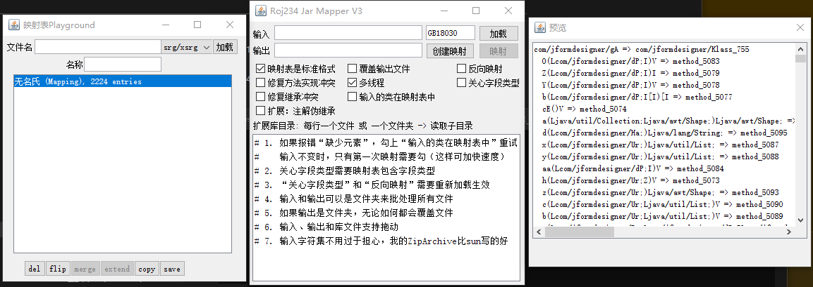
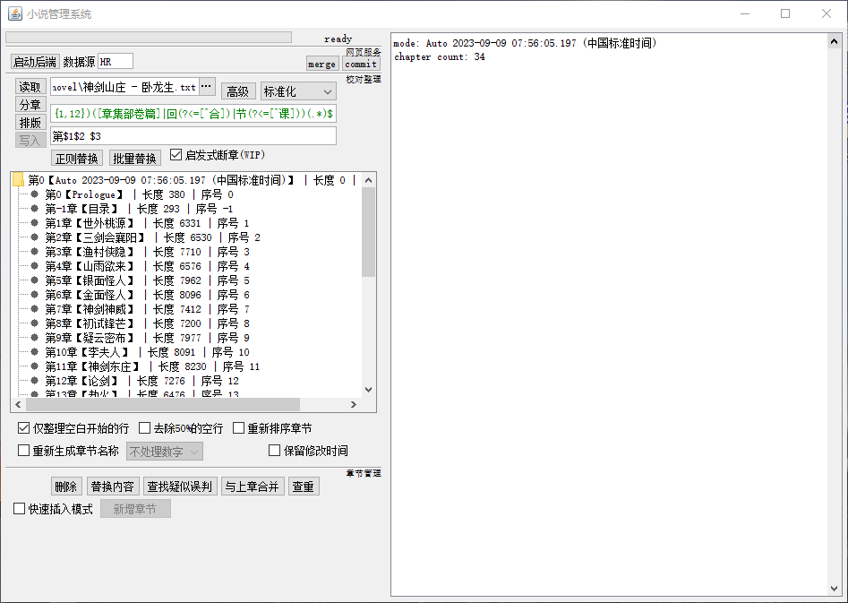
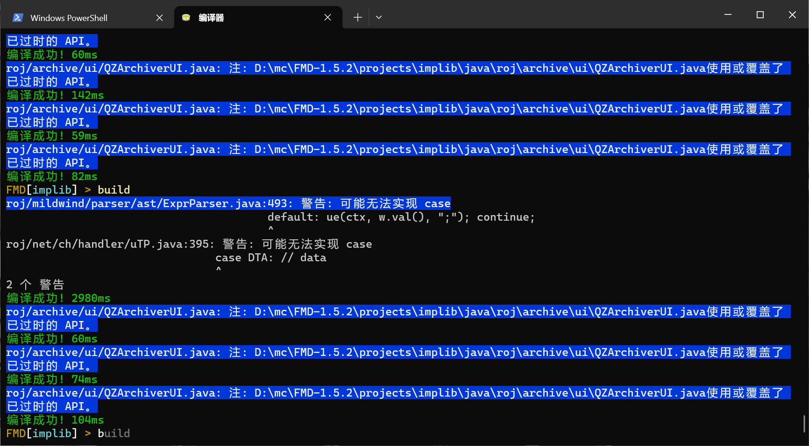
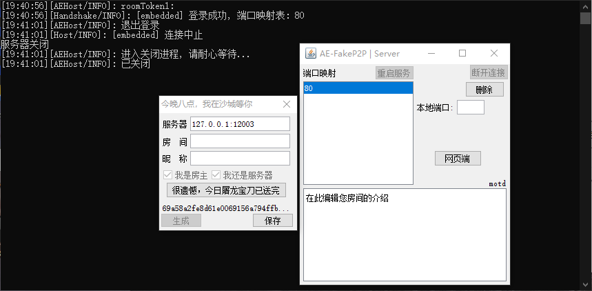

# RojLib v3.0: 模块化的多功能Java库集

RojLib v3.0 标志着一次重要的模块化重构，我们成功将库的核心体积减少了 **50%**，尽管 `core` 模块仍存在一些耦合。

> 自此版本起，所有模块的编译都必须通过我们的 `toolchain` 进行。  
> 由于作者的个人喜好，您可能会发现一些非传统的文件布局——这些都是为了简化作者开发流程而做出的调整。  
> 我们正在积极准备 **编译教程2.0版**，敬请期待。

## 目录

以下是 RojLib 中精选的模块和功能，按照功能领域和字母顺序排列：

---

### Unconscious 响应式Web前端框架
* v1.6.0
* Svelte家的Vue风味的React
* [README](unconscious/README.md)

---

### `roj.compiler` -  Lava程序语言
* 当前版本 1.2.0-alpha
* [文档](compiler/README.md) &nbsp; [命令行入口](compiler/java/roj/compiler/Lavac.java) &nbsp; [嵌入代码使用](plugins/dpi-proxy/java/roj/plugins/dpiProxy/DPIProxy.java)

教程：
* [在家自制编译器·第一章 (WIP)](docs/hbc/part1.md)

---

### `roj.archive` - 高性能压缩库

**ZIP 归档**
*   [读写](core/java/roj/archive/zip/ZipArchive.java) | [新建](core/java/roj/archive/zip/ZipFileWriter.java)
*   **特性:** 任意字符编码、AES/ZipCrypto加密、分卷、增量修改、仅读取CEN（大幅提速）、数据复制（无需解压重压缩）。
*   **复制数据:** 可以从已压缩的ZIP中直接复制数据，不需要解压并重新压缩，这可以大大提升性能
*   **扩展属性:** Info-ZIP UnicodePath, NTFS高精度时间戳。

**7z 归档**
*   [高性能多线程7z压缩和解压](docs/Re_QZArchiver.md)
*   [读取/追加](ext/7z-archive/java/roj/archive/qz/QZArchive.java) | [修改](ext/7z-archive/java/roj/archive/qz/QZFileWriter.java)
*   [增量修改特制分卷压缩格式](ext/7z-archive/java/roj/archive/qz/util/QIncrementPak.java)
*   **特性:** AES加密、分卷、固实压缩、压缩文件头、并行处理、BCJ/BCJ2。
*   **创新:**
    *   支持**固实压缩包的错误恢复**！
    *   全新的并行压缩方式，支持文件级别并行和单个文件内部的并行（仅LZMA2）。
    *   **性能卓越**，部分场景下甚至超越7-zip原生性能。

---

### `roj.asm` - 定制字节码处理框架

一款完全原创的字节码处理框架，在性能、内存占用和易用性方面均优于ObjectWeb的ASM库（至少对本人而言）。

*   [按需解析](core/java/roj/asm/package-info.java)的设计理念保证了极致的速度和低内存消耗。
*   **不支持的功能:** 方法内部注解(TypeAnnotation属性)。

*   **应用:**
    *   [高性能事件系统](ext/eventbus/java/roj/event/EventBus.java): 参考Forge设计模式，支持取消、继承、泛型。
    *   [字节码转换加载器](core/java/roj/asmx/launcher/Loader.java): 参考LaunchWrapper。
    *   [类映射器](core/java/roj/asmx/mapper/Mapper.java): 模组编译必备，速度比SpecialSource快十倍。
    *   [公共注解缓存](core/java/roj/asmx/AnnotationRepo.java): 灵感来自被Forge抛弃的注解JSON格式，使用二进制格式存储。
    *   [类转换器管理器](core/java/roj/asmx/ConstantPoolHooks.java): 支持单点注册特定类或带注解的类的转换器，而非遍历列表。

#### `nixim` - 先进的字节码注入工具

受SpongePowered Mixin启发，`nixim` 提供强大的字节码注入能力，同时**不产生任何GC开销**。  
所有注解的详细使用说明可在 `roj.asmx.injector` 包中查阅。

功能:  注入类、修改方法、实现接口。
*   在方法头、尾或中间插入代码。
*   删除或替换方法。
*   替换常量值、求值语句或方法调用。
*   通过模糊匹配替换连续（不带跳转语句的）代码段。

#### 示例图片


---

### `roj.collect` - 高效集合与数据结构

*   [一种全文搜索算法](core/java/roj/collect/MatchMap.java) | [以及它的文档](docs/Re_MatchMap.md)
*   [带压缩的字典树](core/java/roj/collect/TrieTree.java)
*   [区间交集计算](core/java/roj/collect/IntervalPartition.java): 用于变量作用域分析、合并IO操作等（ZipArchive有用到）。
*   [环形缓冲区](core/java/roj/collect/RingBuffer.java)
*   [XashMap](core/java/roj/collect/XashMap.java): 无额外对象开销的闭合寻址哈希表。
*   [WeakCache](core/java/roj/collect/WeakCache.java): 基于XashMap的自清理WeakRef缓存。
*   [LFUCache](core/java/roj/collect/LFUCache.java): `get`, `put`, `remove` 操作均为O(1)的Lfu缓存。

---

### `roj.concurrent` - 并发工具集

*   [写好了](core/java/roj/concurrent/Promise.java)才发现Java已经有CompletableFuture了。
*   [基于时间轮的定时任务系统](core/java/roj/concurrent/Timer.java)，所有操作耗时均为O(1)
    * 有锁，若不要求删除O(1)可实现无锁(Lock free)。
*   [Stream (青春版)](core/java/roj/util/function/Flow.java): 参考自腾讯云的一篇文章。

---

### `roj.config` - 强大配置解析器

支持多种常见配置文件格式，提供统一的访问接口和人性化错误提示。

*   **支持格式:** JSON, YAML, TOML, INI, XML, NBT, MSGPACK, Torrent (Bencode), CSV, Xlsx。
*   [解析入口和工具类](core/java/roj/config/ConfigMaster.java) 当然也可以不用它
*   **特性:**
    *   包括XML在内，所有配置类型使用[统一结构](core/java/roj/config/node/ConfigValue.java)。
    *   JSON, YAML, NBT, MSGPACK支持**访问者模式**（流式）的读写。
    *   [流式对象序列化](docs/Re_SerializerFactory.md)。
    *   自动识别编码（仅支持中英，可关闭）。
    *   JSONPath查询：形如`a.b[2].c`，参见[CEntry](core/java/roj/config/node/ConfigValue.java)`#query`。
    *   XML支持XPath查询，参见[Node](core/java/roj/config/node/xml/Node.java)`#querySelector`。
    *   Xlsx和Csv支持流式读写，位于[roj.config.table](core/java/roj/config/table)。

#### 标准化且直观的错误提示 (需等宽字体)

```
解析错误:
  Line 39: "最大线程数": 96, , ,
---------------------------^
总偏移量: 773
对象位置: $.通用.
原因: 未预料的: ,
...
```

---

### `roj.crypt` - 密码学与安全工具

*   [JAR签名和验证](core/java/roj/crypt/jar/JarVerifier.java)和自定义ASN.1读写实现。
*   [RS纠错码](core/java/roj/crypt/ReedSolomonECC.java)
*   [高效随机抽样 (FPE)](core/java/roj/crypt/FPE.java)
    *   这是一种空间复杂度为 **O(1)** 的数组打乱算法，适合大规模数据集的随机抽样。
    *   虽然它引入了一定的时间复杂度开销（ O(n log n) 相比传统算法的 O(1) ），但其空间复杂度极为高效，
    *   数组长度需要小于 2^64，如果使用BigInteger，那么无此限制，空间复杂度也会提升到 O(log n)

---

### `roj.ebook` - 电子书工具

*   [EpubWriter](ext/ebook/java/roj/ebook/EpubWriter.java)
*   [小说校对工具](ext/ebook/java/roj/ebook/gui/NovelFrame.java)
    
*   [BsDiff](ext/ebook/java/roj/text/diff/BsDiff.java)

---

### `roj.gui` - GUI相关库

*   [一些可运行的用户界面](app/java/roj/gui/impl)

---

### `roj.http` - HTTP客户端与服务器

支持高性能HTTP通信。

*   [HTTP/2支持](http/java/roj/http/h2) (并没有，因为我没在TLS的ALPN里写h2)
*   长连接、压缩缓存、错误友好、Websocket。
*   [客户端](http/java/roj/http/HttpRequest.java)
*   [服务器](http-server/java/roj/http/server/HttpServer.java)
*   [注解定义的路由器](docs/Re_OKRouter.md) | [代码](http-server/java/roj/http/server/auto/OKRouter.java)

---

### `roj.io` - I/O实用工具
*   [灵活备份删除策略](core/java/roj/io/FlexibleRetiringPolicy.java)
*   [Minecraft Region格式](core/java/roj/io/RegionFile.java)

---

### `roj.math` - 数学工具

*   [可变大整数(暴露的内部API)](core/java/roj/math/MutableBigInteger.java)
*   [定点小数](core/java/roj/math/FixedDecimal.java)
*   [128位整数](core/java/roj/math/S128i.java)
*   [方程求解](core/java/roj/math/Equation.java)
*   [改进的Stitcher](ext/renderer/java/roj/renderer/util/Stitcher.java)

---

### `roj.net` - 网络请求管线

*   [MSSEngine](ext/tls/java/roj/net/mss/MSSEngine.java): 简单安全套接字协议(My Secure Socket)，避免Java内置SSL的复杂性。
*   **已实现:** 加密方式协商、前向安全、0-RTT。

---

### `roj.plugin` - 插件管理系统

一个功能丰富且高度可配置的插件系统。

*   文档：[(并不)安全的插件系统](docs/Re_PluginSystem.md)
*   **特性:** 交互式终端、命令补全、HTTP服务器、热重载、依赖注入、声明式权限管理、依赖管理、生命周期管理。
*   [现有插件列表](app/java/roj/plugins)

---

### `roj.ci` - 持续集成与构建 (MCMake)

[MCMake](toolchain/README.md) 是一款主要为Minecraft模组开发设计的轻量级、快速构建工具。纯Java实现，不依赖外部构建系统。

*   **诞生背景:** 2019年，为了解决ForgeGradle的缓慢和网络依赖，我开始制作MCMake。
*   **核心目标:** 简化Minecraft模组、插件和标准Java项目的开发流程，将开发者精力集中于代码。
*   **优势:** **不联网、体积小、速度快。**
*   **特性:**
    *   增量编译、自动编译、热重载、屏蔽警告（如Java 8 `Unsafe` 警告）。
    *   多版本、多项目支持。
    *   MIXIN、AT、NIXIM（我的字节码注入工具）支持。
    *   项目依赖管理、自定义构建、变量替换、Maven集成。
    *   大量自定义注解。
    *   **不在用户文件夹写入任何文件！**
*   **独家特性:** 支持没有任何其他开发工具支持的子类实现重映射，这个bug直到2025年还在1.19.2最后一个版本的灾变模组里出现！
    * 我的映射器能自动发现并修复，详情见[Mapper](core/java/roj/asmx/mapper/Mapper.java)`#S2_3_FixSubImpl`。

#### 示例图片


---

### `roj.plugins` - 实用插件集

一系列功能性插件，解决各种实际需求。

*   [DDNS更新器](plugins/ddns-client/java/roj/plugins/ddns/DDNSClient.java): 支持阿里云、DynV6、Tracker。
*   [Nvidia GPU功耗优化器](app/java/roj/plugins/CardSleep.java): 针对40系以前台式机显卡。
*   [安全密码生成器](app/java/roj/plugins/MyPassIs.java)
*   [Websocket Shell](plugins/websocketd/java/roj/plugins/Websocketd.java)
*   [简单单点登录系统 (EasySSO)](plugins/easy-sso/java/roj/plugins/sso/EasySSO.java)
*   [PHP支持与FPM实现](plugins/php-fpm/java/roj/plugins/php/PHPFpm.java): 在Windows上实现PHP-FPM。
*   [Minecraft服务端协议实现 & 行为验证码](app/java/roj/plugins/minecraft/server/MinecraftServer.java): 1.19.2版本。
*   [文件包解包工具](app/java/roj/plugins/unpacker/Unpacker.java): 解压并导出`asar`、`har`或小红车的壁纸。
*   [高性能端口转发程序 (WIP)](app/java/roj/plugins/frp/MyFRP.java): 重构中。
    *   客户端与服务器使用自签证书 (用户ID)。
    *   中转服务器模式支持多个房间（主机）并行。
    *   
*   [NAT打洞](docs/Re_NAT.md) | [代码](ext/p2p/java/roj/plugins/p2p/UPnPGateway.java)
*   [中英拼音混合文本搜索 (基于DP)](ext/pinyin/java/roj/text/pinyin/TextSearchEngine.java): 参考JavaScript `text-search-engine` 项目。

---

### `roj.reflect` - 反射优化与高级特性

解决Java反射的高级需求和性能瓶颈。

*   [Java 8-21通杀的高性能反射解决方案](docs/Re_Bypass.md): 现已兼容Java 22 (not really™)
*   [获取Caller实例对象](core/java/roj/reflect/Reflection.java): 类似于JavaScript的 `callee`。
*   [VarHandle动态替换为Unsafe以提升性能](core/java/roj/util/optimizer/VarHandleRewriter.java)
*   [虚拟引用 (VirtualReference)](core/java/roj/reflect/VirtualReference.java): 通过修改GC Root，实现动态生成类的精确卸载，无额外开销。
*   [无开销本机方法调用](core/java/roj/util/optimizer/Intrinsics.java): 在Java中直接集成汇编代码。 (与部分JVM存在兼容性问题)

---

### `roj.sql` - 数据库操作

*   从我之前的PHP框架复制的[简易链式SQL查询](ext/sql/java/roj/sql/QueryBuilder.java)。
*   [连接池](ext/sql/java/roj/sql/ConnectionPool.java)
*   [注解定义的DataAccessObject](docs/Re_DAOMaker.md)

---

### `roj.text` - 文本处理工具

*   [简易日志记录器](core/java/roj/text/logging/Logger.java)
*   [自动识别文本编码](docs/Re_ChineseCharset.md)
*   [快速浮点数解析器](core/java/roj/text/FastDoubleParser.java)
*   [快速字符串编解码](core/java/roj/text/FastCharset.java)
*   [直接操作long的日期解析](core/java/roj/text/DateFormat.java)

---

### `roj.ui` - 命令行界面 (CLI)

需要支持虚拟终端转义序列的TTY（Windows可能需要 `libcpp.dll`）。

*   [带命令补全的终端模拟器](docs/Re_CommandConsole.md): 基于虚拟终端序列。
*   [声明式命令](core/java/roj/ui/CommandNode.java): 参考OJNG的指令注册
*   [ANSI进度条](core/java/roj/ui/EasyProgressBar.java): 支持多实例，undetermined数量，ETA估算等。
*   [内存分配器](core/java/roj/util/Bitmap.java)

---

### `roj.util` - 通用实用工具

*   [对'结构体'排序](core/java/roj/util/Multisort.java)
*   [本机内存操作](core/java/roj/util/NativeMemory.java)
*   [共享内存](core/java/roj/util/SharedMemory.java)
*   [动态ByteBuffer (DynByteBuf)](core/java/roj/util/DynByteBuf.java): 可扩展，支持写入流等，可作为`Input/OutputStream`, `DataInput/Output`。

---

## 系统属性 (Properties)

您可以通过设置以下系统属性来配置RojLib的行为：

*   `int roj.nativeDisableBit`: [禁用native优化] (RojLib)
*   `int roj.cpuPoolSize`: [CPU Count] (TaskPool)
*   `String roj.text.outputCharset`: [UTF-8] (TextWriter)
*   `Path roj.archiver.temp`: [.] (ArchiverUI)
*   `File roj.compiler.i18n`: [null] (Lava Compiler)
*   `Path roj.compiler.symbolCache`: [.lavaCache]
*   `Enum<auto, off, strip, force> roj.tty`: [auto]
*   `boolean roj.config.noRawCheck`

---

## `Libcpp.dll` 支持

`Libcpp.dll` 提供了额外的平台特定优化：

*   **Windows 平台:**
*   共享内存、重用端口、ANSI终端转义。
*   [Fast LZMA2](https://github.com/conor42/fast-lzma2) (WIP)。
*   **通用功能 (跨平台):**
*   AES-NI、BsDiff、XXHash。

> **Q: 为什么不为Linux做优化？**  
> A: 因为没有人问 ×

---

# 特别鸣谢
Gemini 2.5
* 大部分readme都是它polish的！

DeepSeek
* S128i的基础结构
* RS纠错码的部分重构
* 名称标准化的大部分建议
* 大量Javadoc
* 部分前端页面
* 从9月开始的一些commit message

JFormDesigner
* 让我不用碰恶心的AWT界面

STM32F10X
* 让我意识到C语言多么简单

@huige233
* 提供了很多梗图
* 提供了子模块的命名建议
* 提供了一些乱七八糟还被我真的实现了的需求
* 在我学会用IDA之前提供了一些Assembler中的opcode

@icybear
* 讨论&学习有关asm的内容
* 在我拆compiler和完成FrameVisitor时提供了一定帮助

*(int*)*(void**)
* 提供编译器语言文件使用resource bundle的建议以支持IDE补全
* 在我无聊的时候陪我聊天

@huzpsb
* 提供了一个很好的群组用来交流

黄豆
* 为7z压缩GUI提供了设计建议
* 找到了一些bug
* 给我的硬盘增加了许多写入量
* 为Lava语言提供了有关【无符号数据类型】的建议

ETC
* 提供EpubWriter的新模板
* 汇报EpubWriter的bug

CraftKuro
* 帮助安装和配置OpenWRT
* 提供情绪价值（吉祥物 ×）
* 提供Kuropack的命名（其实是我硬要贴上去的）
* 提供部分文本
* 试玩游戏

咖喱人
* 提供很多很多支持 (真的)
* 提供编程天赋 (雾, 但大概也是真的)