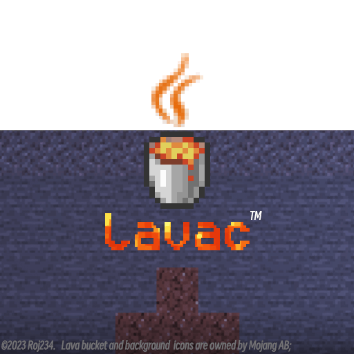

# Lava™ 编译器

> *注：Lava™和Logo纯属玩梗，未注册任何商标*

Lava™ 是一个实验性的编译器，目前处于持续开发（WIP）阶段，专注于语法层面的创新扩展和插件友好设计。它不是官方编译器的直接替换品，而是旨在让你的代码更简洁、更强大——借鉴 Python、JavaScript 等语言的精华，同时保持 JVM 兼容。当前处于持续开发 (WIP) 阶段，欢迎探索！

Lava™ 通过高度可扩展的 API 和内置插件系统，允许开发者方便的自定义语法、优化字节码，并注入现代特性，如命名参数、多返回值和运算符重载。
它的设计哲学是“更香”：减少样板代码，提升可读性和性能。

## ✨ 核心亮点

- **语法糖增强**：命名参数 (`List.of(e1: null)`)、多返回值 (`return {3, 5, "233"}`)、`for-else` 循环、集合字面量 (`[1, 2, 3]`) 和可选链 (`a?.b?.c`) —— 让代码更 Pythonic 和 JS-like。
- **性能优化**：编译期分支剪枝、尾递归转换、`for-each` 索引访问、联合类型 (`Union<String, Integer>`) —— 减少字节码体积，提升运行时效率。
- **扩展机制**：运算符重载 (`@Operator`)、生成器 (`yield`)、`defer` 资源管理、宏 (`@LavaMacro`) —— 支持自定义 DSL 和零成本抽象（如 `StreamChain` 链式展开）。
- **插件生态**：内置插件如 `@Attach` (附加方法)、无符号类型 (`uint32`)、属性访问 (`@Property`)。通过 `InvokeHook`、`AStatementParser` 等 API 轻松扩展字节码和解析器。
- **未来愿景**：计划支持本机映像 (x86/ARM，非 JVM)、`async/await`、基本类型泛型和手动内存管理——从 JVM 跳向更高效的运行时。

示例：一个多返回值 + 解构的简单函数
```java
static [int, String] multiReturn() {
    return {42, "Hello, Lava!"};
}

var {result, message} = multiReturn();  // 自动解构
System.out.println(result + ": " + message);
```

## 🚀 快速开始

1. **克隆仓库**：
    - TODO

2. **构建与运行**：
    - TODO

3. **示例项目**：查看 `examples/` 目录，包含最新的 demo。

更多文档：见 [功能概览](docs/FEATURES.md) 、 [插件API](docs/PLUGINS.md) 和 [内部结构](docs/INTERNAL.md)。

## 🌟 开发中的特性
* 非静态类的泛型
* instanceof cast (VisMap)
* 方法中的具名类

## 🚗 本机映像
我们计划在未来版本中支持Lava语言直接编译到二进制(x86/arm/LLVM asm)。  
计划（未来可能更改）：
- 这不是GraalVM，仅仅是语法相同的Lava——这真香。
- 你能写汇编
- 本机标准库将由我们实现，而不是JVM
- 提供手动内存管理接口——例如析构函数以及free
- 可选简单的引用计数&STW GC
- lambda接口可以转换为函数指针
- 提供统一的确定性反射API —— 参考VDOM在SSR中的应用
- 预计将在NaN年内提供实验性支持。

## ⚠️ 重要提示
- **兼容性**：部分较少使用的语言特性，例如注解和方法私有类等，未支持或行为不同；不支持标准库的编译器API；迁移需适配。
- **稳定性**：许多特性 WIP，目前非 production-ready。
- **生态**：依赖 RojASM 生成字节码，与 ObjectWeb 遵循不同的设计哲学；开发插件需要一定学习成本。


## 🤝 贡献与社区

- 欢迎 PR 实现 WIP 特性、修复 bug 或添加插件！
- 报告 issue：[GitHub Issues](https://github.com/roj234/rojlib/issues)。
- 讨论：[Discord/Forum 链接] 或邮件 `lava@example.com`。

Lava™ 旨在成为一个我也不知道是什么的东西，总而言之，希望他最终能成年

---