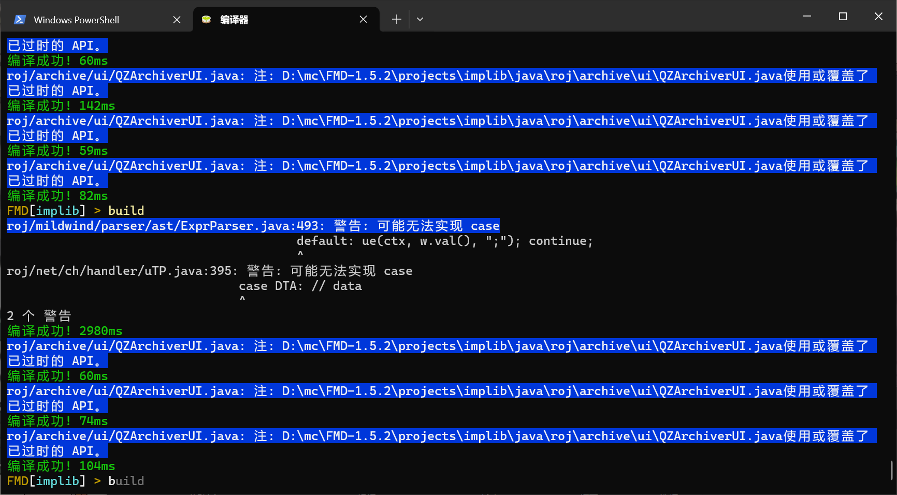

# 带指令注册的终端模拟器
 * [x] tab补全
 * [x] 指令历史记录
 * [x] Ctrl+C / Ctrl+V
 * [x] 指令太长自动切换
 * [x] 简易语法高亮 (可以自己换 roj.ui.terminal.DefaultConsole去看)
 * [x] 快捷键监听(F1 - F12)
 * [x] 活动的命令行始终显示在最下方 (效果图中第一个是println的)

## 效果


## 代码

```java
import roj.ui.Terminal;
import roj.ui.Shell;
import roj.ui.Argument;
import roj.ui.Command;

import static roj.ui.CommandNode.argument;
import static roj.ui.CommandNode.literal;

/**
 * 代码来源roj.plugins.ci.FMD
 */
public final class Example {
	public static Shell console = new Shell("");

	@SuppressWarnings("fallthrough")
	public static void main(String[] args) throws Exception {
		Shell c = console;

		// 简单的指令
		c.register(literal("reflect").executes(ctx -> ReflectTool.start(!isCLI)));
		c.register(literal("auto").then(argument("auto", Argument.bool()).executes(
				ctx -> AutoCompile.setEnabled(ctx.argument("auto", Boolean.class)))));

		// 复杂一点的Argument
		Command cDeobf = ctx -> {
		};
		c.register(literal("deobf").executes(cDeobf)
				.then(argument("reverse", Argument.string("mcp2srg", "srg2mcp")).executes(cDeobf)));

		// 变长参数
		c.register(literal("build").then(
				argument("flags", Argument.stringFlags("zl", "showErrorCode", "noupdate")).executes(ctx -> {
					List<String> flags = Helpers.cast(ctx.argument("flags", List.class));
					Map<String, Object> map = new MyHashMap<>();
					for (String flag : flags) map.put(flag, "");
					build(map);
				})));

		// 甚至是自定义参数
		Argument.ArgSetOf<File> dynamicProject = new Argument.ArgSetOf<>(1, new MyHashMap<>()) {
			@Override
			protected void updateChoices() {
				choice.clear();
				IOUtil.findAllFiles(CONFIG_DIR, (f) -> {
					String name = f.getName().toLowerCase();
					if (name.endsWith(".json")) choice.put(name.substring(0, name.length() - 5), f);
					return false;
				});
			}
		};

		// prompt (new的参数也是)
		c.setPrompt("114514 > ");
		// 别忘了
		Terminal.setConsole(c);

		// Console线程也是daemon的
		LockSupport.park();
	}
}
```