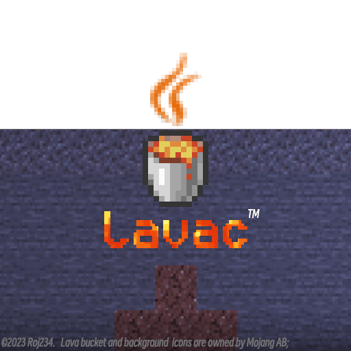

# Lava™ 编译器 (WIP)


> *注：本项目纯属玩梗，未注册任何商标*

## 使用须知

Lava 编译器并非 Javac 的替代品，其 API 专为语法扩展设计（相比 Javac API 更易扩展）。请注意：
- 不支持完整的 Javac API 和部分 Java 语言特性
- 编译插件生态兼容性有限
- 特定语法特性的迁移可能存在适配成本

## 绝赞语法

### 🎯 参数命名调用
```java
List.of({e1: null, e2: 3});
List.of(null, null, {e3: null, e4: null})
```
- 仅支持作为方法的最后一个参数
- 重载方法可能产生非常不直观的推断错误

### 🔒 synchronized 扩展
**警告：修改默认行为**  
通过 `LavaFeatures.SYNCHRONIZED_LOCK` 启用：
```java
synchronized(lockInstance) {
    // 自动调用 lock()/unlock() 代替 monitorEnter/Exit
}
```
你不再需要使用try-finally加锁和解锁了

### 🔁 for-else (部分实现)
这个语法来自python, 目前只有for支持, while和do-while不支持
```java
for (int i=0; i<arr.length; i++) {
    if (i == 8) break;
} else {
    System.out.println("循环未通过 break 终止");
}
```

### 🎁 多返回值
一个方法可以返回多个值。  
其中基本类型占用的字节数不能超过1KB(256个int/128个long)，对象类型无限制。  
使用ThreadLocal对象，而非浪费内存的不可变对象，所以
禁止套娃 (带编译期错误)  
必须使用下面的方法解包，因为编译器会自动插入参数类型哈希用于验证，并在适合的时候抛出IncompatibleClassChangeError  
不需要的参数可以用_跳过  
为什么用方括号和花括号，是为了不修改默认行为，例如var[]是合法的， {}又是静态构造器
```java
static [int, long, String] multiReturnTest() {
    return {3, 5, "233"};
}

var {a, _, c} = multiReturnTest();
```

### ⚡ 分支忽略
如果一个块选择语句（if、while、switch）的值是编译期常量，那么比较会在编译期完成  
for、do-while等其它语句也会根据常量进行一定优化  
下列代码能够通过编译  
可以方便支持多版本依赖的项目
```java
if (false) {
  /* 不可能的分支将被忽略 */
  fsdjghsdfnnv95&%^&%^&fnnvbnvbada;ear
} else {  
  System.out.println("1");
}
```

### 📜 For-each优化
针对【同时实现List和RandomAccess接口】，或具有【RandomAccessible】注解的类，其foreach循环将按顺序访问而非使用Iterator进行编译。  
若要在多线程环境中迭代（必须使用Iterator），请考虑使用 DisableOptimization 注解以禁用该优化。

###  🎛️ 参数默认值
  在方法定义处使用形如 `method(int a = 3)` 的语句来为参数指定默认值  
  默认值可以是*任意*表达式，实际上它相当于一个宏，你可以使用仅在函数调用上下文可用的变量  
  如下代码将**编译成功**
```java
static void test(int a = 3, Object o = some_variable) {
    // ...
}

{
    int some_variable = 5;
    test(5);
}
```

### 🦄 单方法抽象类 Lambda (WIP)
  只有一个抽象方法的抽象类（不是接口），也可以使用lambda(不过会编译成new匿名类)
```java
AbstractType obj = () -> System.out.println("Magic!");
```
  TODO: 没有抽象方法的可继承类，使用*什么*指定一个方法？

### 覆盖隐式方法
所有隐式生成的方法，例如Enum.valueOf和values都可以由你手动覆盖，覆盖后编译器不再会生成相同的方法  
访问权限修饰符必须和它应有的相同，否则会编译期错误

### MapLiteral / ListLiteral
  使用类似PHP的语法来构建Map&lt;?,?&gt;
```java
var map = [ 1+1 -> 3+4 , "mixed type" -> also.can.be.used() ]; // Map<Object, unknown> (可变)
var list = [1, 2, 3]; // List<Integer> (不可变)
```

### 跳转
  使用goto语句在任意标签之间跳转  
  * 警告，由于VisMap并没有那么可靠，goto可能会导致编译器在StackMapTable生成阶段崩溃

### 基本类型附加函数
  12345 . toHexString() => Integer.toHexString (static)  
  请注意为了防止被解析为浮点数，你需要在小数点前添加空格或使用括号

### Switch扩展
- Lavac生成的switch语句具有更小的文件大小和更优越的性能。
- 任何类都可以像枚举一样进行switch操作。
- 时间复杂度为O(1)。
- 使用@Switchable注解改变默认行为
- 使用 DisableOptimization 注解禁用此功能。
- 支持基本数据类型和运行时常量。
```java
        var v = Test.A;
        switch (v) {
            case Test.A -> System.out.println("A");
            case Test.B -> System.out.println("B");
            case Test.NulL -> System.out.println("null (real)");
        }
```
#### SwitchEx (WIP)
  看到隔壁CSharp那么多switch的语法糖，我给switch加了一个goto default  
  你可以用goto default跳到default分支的开始，不能在default分支中使用

### 操作符重载
  重载已有的运算符，或添加自定义的运算符，它们能被替换为任意表达式，还支持右结合  
  允许重载的运算符（重载优先级最低，你无法覆盖!true这种运算）：  
  * 二元运算符 + - * / % ** << >> >>> & | ^ && || ?? == != < >= > <=
  * 前缀后缀运算符 ++ -- ~ !  
  * 修改赋值运算符 += -= *= /= %= **= <<= >>= >>>= &= ^= |=  

不支持重载的
  * 三目 ? :
  * lambda ->
  * 赋值 =
  * 取值 . ?.
  * 扩展 ...
  * 方法引用 ::

### 可选连接操作符
```javascript
 var nullable = a?.b?.c?.d;
```
任意为null => 结果为null  
支持方法调用 a?.b()?.c;

### 基本类型泛型 (WIP)
  通过模板生成基本类型的泛型类，在运行时节约内存  

### 连续泛型推断
```java
public class Test {
    static <T> T inferType(T example) { return example; }
    
    static <K, V> TypedMapBuilder<K, V> builder(Class<K> keyType) {return null;}
    interface TypedMapBuilder<K, V> { Map<K, V> build(); }

    public static void main(String[] args) {
        // 在Javac中将会类型推断失败，返回Map<String, Object>
        Map<String, Integer> map1_1 = Test.builder(String.class).build();
        Map<String, Integer> map1_2 = inferType(Test.builder(String.class)).build();

        // 成功
        Map<String, Integer> map2 = Test.<String, Integer>builder(String.class).build();
    }
}
```

### finally优化
  在多个嵌套的finally块中，防止代码体积暴增

### 隐式导入|ImportAny (部分实现)
使用import *开启  
若全局没有同名的类，则该类视为已导入，妈妈再也不要去操心import了  
你还可以使用 import module java.base  仅导入一个模块下所有export的包  
使用该功能无需激活模块编译

### 受信执行环境|Package-Restricted
在任何import语句之前，可以插入package-restricted关键字。  
启用此选项后，只能使用通过import语句导入的类。  
若需取消导入特定类（可能是由于使用import *通配符导入），可通过使用import - className来实现。此外，可以省略减号旁边的空格。  
在使用方法返回值或字段时，同样会对它们的类型进行导入检查，从而有效地防止某些潜在的漏洞。

### 别名导入
  import a.b as c;  
  或  
  import static a.b as c;

### with
```javascript
with (System.out) {
    println("hello world!");
}
```
如果需要对某个类静态的使用，你可以 with (X.class) {} 或者，简单的import static

### 可选的分号
大部分语句可以省略分号  
缺点：目前这会造成diagnostic的位置漂移到下一行

### defer (已实现)
在代码块结束时，可以通过try-with-resource形式执行多个表达式。  
如果其中一个表达式发生错误，不会影响其他表达式的执行，所有异常会一起抛出。  
此外，可以与AutoCloseable接口混用。最后一个分号可以省略。  
尽管可能无法完全避免缩进，但至少可以减少使用try-finally的情况。

需要注意的是，defer的执行顺序和定义顺序是相反的（对于AutoCloseable是先创建的实例后调用close方法）。下面是代码执行的结果：
- 打印 b
- 打印 a
- 关闭文件输入流
```java
try (
      var in = new FileInputStream(...);
      defer System.out.println("a");
      defer System.out.println("b");
) {
    
}
```

### 尾递归优化
在return中调用当前函数会被转换为循环而不是再次调用
* 对于不可继承的方法（含有任意修饰符：static，final，private），它是自动启用的
* 对于其它方法，你可以使用@Tailrec注解来启用优化
* 你也可以使value=false来禁用优化

### 生成器函数
* 定义 (函数名称前带星号)
```java
    static String *generatorTest(String inputArg) {
        yield inputArg+="a";
        yield inputArg+="b";
        yield inputArg+="c";
    }
```
* 使用方法 (注意事实上返回了Generator<String>, 你可以在这里面使用基本类型泛型参数！)
```java
    Generator<String> itr = generatorTest("喵");
    while(itr.hasNext()) {
        System.out.println(itr.next());
    }
    // 喵a
    // 喵ab
    // 喵abc
```
* 优先级低于switch中的yield
* 通过匿名类实现，可参考有栈协程（貌似不再像看起来那么牛逼了）

### 编译期联合类型

#### 功能概述
`roj.compiler.api.Union` 是编译器支持的**联合类型**特性，允许方法声明返回多个可能的类型（如 `String | Integer | Map<String, Integer>`）。在编译期进行类型约束检查，运行时通过模式匹配安全处理具体类型。

#### 核心代码示例
```java
// 声明返回 String/Integer/Map<String, Integer> 其中一种类型
static Union<String, Integer, Map<String, Integer>> manyTypes() {
    return "asdf"; // 实际返回 String 类型
}

public static void main(String[] args) {
    // 接收联合类型返回值 (当然，也支持不使用var的声明，但这没有必要)
    var x = manyTypes();
    
    // 类型安全的模式匹配
    String n = switch (x) {
        case String s -> s;         // 处理 String 类型
        case Integer l -> l.toString(); // 处理 Integer 类型
        case Map<String, ?> m -> m.toString();   // 处理 Map 类型 (我在这里故意使用了更不具体的类型，表示Union非精确匹配)
    };
    System.out.println(n); // 输出: "asdf"
}
```

#### ✨ 关键特性
1. **编译期类型约束**
   - 方法返回值明确声明为 `Union<Type1, Type2, ...>`
   - **禁止返回 `null`**，否则触发编译错误：
     ```
     错误: <AnyType>不可能转换为* extends String&Integer&Map<String, Integer>
     ```
   - 禁止返回类型擦除后相同的泛型类型，因为无法在运行时通过checkcast验证

2. **运行时类型安全**
   - 必须用 `switch` 覆盖所有声明类型
   - 未处理 `null` 时抛出 `IncompatibleClassChangeError`
   - 缺少分支会导致编译错误（如删除 `case Map<String, Integer>`）

3. **模式匹配优化**
   - 用起来和record类型是差不多的，支持自动类型转换等

#### ⚠️ 重要注意事项
| 场景 | 后果 | 解决方案 |
|------|------|----------|
| 返回 `null` | 编译失败 + 类型转换错误 | 确保返回值非空 |
| 缺失分支 | 编译错误 | `switch` 覆盖所有 `Union` 声明类型 |
| 运行时值为 `null` | `IncompatibleClassChangeError` | 添加 `case null` 分支处理 |

#### 最佳实践
```java
// 建议：显式处理 null 值
String result = switch (x) {
    case String s -> s;
    case Integer i -> i.toString();
    case Map<?,?> m -> m.toString();
    case null -> "[null]"; // 安全处理 null
};
```

> **设计意图**：在静态类型语言中模拟联合类型，通过编译期检查消除运行时可能产生的 `ClassCastException`，提升类型安全性。  
> 顺便提一嘴：你可以在pattern switch中使用不冲突的具化泛型类型，例如Map&lt;String, Integer>，而不是Map&lt;?,?>

### PseudoType (伪类型)
相关API：
  * Type#DirtyHacker
  * ValueBased
  * Operator Override: Paren

虽然看起来是一个对象类型，但实际上不一定是  
将这种类型传递到方法之外（包括lambda和内部类）的结果是未定义的  
真的未定义，因为太hack了所以我只测试了在方法内部的执行  
如果你将其作为参数或字段类型，编译器将会报错，除非该类型允许被擦除到某种基本类型

```java
//UintPlugin
uint32 unsignedType = -114;
System.out.println(unsignedType > 114);
System.out.println(""+number);
```
### async / await
   Promise (WIP)

# 扩展功能 (通过Lavac插件API实现)
## Annotations插件
### @Attach
  将静态函数附加到其它类上

```java

import roj.compiler.plugins.annotations.Attach;

@Attach
public class Attacher {
    public static boolean isNotEmpty(String s) {
        return !s.isEmpty();
    }
}

```

这么做之后，无论这个类以源代码编译还是在classpath中  
都可在字符串对象（或它的子类，虽然字符串是final的）上使用 isNotEmpty() 函数  
与某些编程语言不同，**这是全局的**，而不是只能在一个包内使用，所以可能导致名称冲突
### @AutoIncrement
  以指定的start和step为每个字段分配整数常量值
```java
@AutoIncrement(value = 100, step = 1)
public static final int A,B,C,D;
```
等效于  
public static final int A = 100,B = 101,C = 102,D = 103;
### @Getter/Setter
  生成getXXX和setXXX方法  
### @Property
  以属性访问getter和setter  
  这个注解可以*堆叠*
* getter和setter可以自动从value生成，但不会为布尔值生成isXXX，依然是getXXX
* 你也可以手动输入名称
```java
@Property(value = "some", getter = "getSome", setter = "setSome")
public class Some {
    public String getSome() { return "我是一个字段"; }
    public void setSome(String setter) {}

    {
        System.out.println(this.some);
        this.some = "awsl";
        System.out.println(this.some);
    }
}
```
  你可以直接以属性调用这些字段
### @Operator
  自定义操作符  
  WIP
  * 目前仅能使用Lavac的API自定义操作符
## Asm插件
### 参数注入 / inline ASM / 泛型转换
通过 &lt;T&gt; T ASM.inject(String 名称, T 默认值) 获取通过编译器参数或插件注入的属性，虽然方法签名是泛型，但属性可以是任意表达式，并且可能和def类型不同  
通过 boolean ASM.asm(Consumer<CodeWriter> 另一种宏) 在编译期间修改生成的字节码，若ASM插件已加载，它将返回false常量，你可以用它实现条件编译，这个lambda表达式无法使用方法中的变量，并且也会在受限环境中执行  
通过 &lt;T&gt; T ASM.cast(Object 源类型) 实现泛型类型的无条件转换，例如将List&lt;String&gt;转换为List&lt;Integer&gt;

## Evaluator插件
### 编译期执行
使用@Constexpr标记纯函数  
纯函数可以在编译期执行  
纯函数目前并不会编译两次，而是“只读取classpath中已经编译好的纯函数”  
纯函数的入参和返回值只能是字符串或基本类型，和它们的数组  
纯函数只能使用白名单内的少部分类
### 数组压缩
将基本类型数组压缩为字符串(Base128)，减小文件体积  
目前支持int[]和byte[]，你可以这么写：  
RtUtil.unpackI(RtUtil.pack(new byte[] { ... }));
### 宏
使用“@LavaMacro { ... }”编写一个宏  
宏类似于一个lambda代码块，其中有且仅有一个参数，CharList code  
注意：在目前版本中，这不是一个真实的注解！  
举例:  
@LavaMacro { code.append("1+1"); }  
将会编译为1+1  
宏可以使用Lava的所有特性，不过依然只能使用白名单内的少部分类
## Uint插件
### 无符号数据类型
```java
    uint32 number = -7;
    System.out.println("(uint32) -7 = " + number.toString());
    System.out.println("(uint32) -7 + 12 = " + (number + 12).toString());
    System.out.println("number > 114514 = " + (number > 114514));
```
## MoreOp插件
### 扩展的数组取值操作符
数组取值 a[b] 现在可以对Map或List使用了，分别编译到get/set  
集合可以使用 += 来add或者addAll  
基本上就是表达式API的示例
## StreamChain API
编译期展开链式调用，实现零成本抽象
### 下面的语句将编译为一些if，而不是这些方法调用
```java
    var awa = ComparisonChain.start().compare(2.0, 1)
    time += awa.compare(1, 2.0).result()
```
## TypeDecl插件
### 加入了支持编译期泛型推断的__Type( type )表达式

## 🌟 本机映像
我们计划在未来版本中支持Lava语言直接编译到二进制(x86/arm/LLVM asm)。  
计划（未来可能更改）：
- 这不是GraalVM，仅仅是语法相同的Lava——这真香。
- 你能写汇编
- 本机标准库将由我们实现，而不是JVM
- 提供手动内存管理接口——例如析构函数以及free
- 可选简单的引用计数&STW GC
- lambda接口可以转换为函数指针
- 提供统一的确定性反射API —— 参考VDOM在SSR中的应用
- 预计将在2027年内提供实验性支持。

# 不支持的特性
### 开发中
* 非静态类的泛型
* instanceof cast (VisMap)
* 方法中的具名类

### 无支持计划
* java compiler API

当前正在解决反射和动态代理的兼容性问题，预计将在 2024 Q4 提供实验性支持。

## 项目结构
### 解析核心
 * 结构解析器 CompileUnit
   1. 解析定死的结构，比如类的结构，字段，函数名称，参数返回值，装饰器什么的，函数内部的内容通过括号匹配直接跳过，赋值语句调用表达式解析器，但不resolve，把这些包装为多个”解析任务“
   2. 此时已经知道所有类的数据了，就可以解析导入表，将短名称resolve到全限定名，计算字段常量值，检测函数重载……
   3. 调用预处理阶段装饰器的处理函数
   4. 运行解析任务
   5. 生成代码


 * 解析任务 ParseTask  
   解析任务包含了对代码分词器的位置引用以及解析结果存储到的目标  
   任务的种类包括字段赋值语句，装饰器赋值语句等表达式解析任务  
   以及方法和构造析构函数等方法解析任务


 * 方法解析器 BlockParser  
   方法解析器分析方法结构，比如for，if，break，switch等语句，并不时调用表达式解析器  
   同时处理部分优化，比如死代码消除和寄存器分配  


 * 表达式解析器 ExprParser  
   表达式解析器负责分析表达式结构，比如加减乘除，函数调用，字段赋值，变量自增等  
   if，switch同时能作为语句和表达式，会和方法解析共用代码  
   表达式解析又由三个部分构成：
   1. 预处理  
      如果允许变量赋值，看看这个'表达式'是不是变量赋值语句
   2. 算子  
      由连续的'算子'序列构成一个'子表达式'，每个算子可能前进到相同或后续类型的算子：
      1. 前缀算子（前缀自增等）
      2. 值生成算子（立即数、数组等）
      3. 值转换算子（方法调用、字段取值、圆括号等）
      4. 终结算子（后缀自增、instanceof、三目运算符等）
   3. 连接符
      包括所有的二元运算符，比如加减乘除，可以连接下一个子表达式
      还包括分号逗号等符号，将结束解析流程

   解析结束后，根据运算符优先级从高到低在算子列表中选取对应位置的算子，并用"二元运算"算子将左右值合并为一个算子
## 包结构
API
1. 注解处理器
2. 自定义语法API
   - 可以在全局编译上下文中修改优先级表，或者通过StateMap简单的插入自定义语法："遇到注册的自定义token时，给回调函数当前的AST和Lexer，解析然后把新的AST返回"
   - 这些修改会在创建新的表达式解析器时应用
3. StreamChain API
   - 允许将链式调用，例如 a().doFoo().doBar().get() 中的对象消除，根据所有函数的名称和参数在编译期生成代码

asm 代码生成
1. 方法生成器 MethodWriter
   - 方法解析器调用它立即生成代码
   - 使用分段的"标签"来处理偏移
2. 标签 Label
   - 使用[段索引,偏移量]来表示一个代码位置
3. 代码块 CodeBlock
   - 代码块只能在后方追加代码（* 仅SolidBlock能追加），而已经有代码的部分不再改变
   - 其余代码块只有长度可能改变
   - 这样，标签引用的位置就是稳定的
4. 变量 Variable
5. 泛型 LPGeneric | LPSignature
6. 用于类型转换判断的Asterisk类型

ast 语法树
1. 解析任务 ParseTask
2. 方法解析器 BlockParser
   - 方法解析器是即时写入的，不存在方法层结构的语法树节点
   - 需要实现类似语法树节点的暂存时，会在新的方法生成器上写入，然后将整个生成器打包为代码块
3. 表达式解析器 ExprParser
4. 表达式语法树节点 ExprNode
5. 变量初始化状态管理器 VisMap (neta TC)，全称是Variable Initialization State Map
   - 保存和计算变量的赋值状态
   - 表达式和方法解析器会在变量的赋值和读取时调用对应方法，比如读取未赋值的变量将会报错
   - 赋值会进行SSA转换，辅助方法解析器的寄存器序号生成 (WIP)
6. 寄存器映射计算器 VarMapper
   - 目前使用基于变量实际生命周期的区间分配
   - 未来SSA了会优化
   - Javac是形式生命周期，所以在不考虑JVM优化的情况下，会多占用不少槽位

context 上下文
1. 全局编译上下文 LavaCompiler
   - 负责生成线程本地的编译上下文，词法分析器，方法分析器，表达式分析器
   - 包含全局符号缓存和解析缓存
2. 本地编译上下文 CompileContext
   - 包含大部分不支持多线程和递归的对象，例如，方法分析器，供编译器调用
   - 包含文件中只在当前阶段有效的状态，节省CompileUnit的空间。
   - 包含对象缓存，复用一些SetListMap什么的
   - 包含next和prev方法，用于单线程中的递归解析
3. 核心符号缓存 LibrarySymbolCache：解析并缓存标准库的符号表
4. 用户符号缓存 LibraryCompactKlass：由用户提供的库文件

resolve 解析
1. 解析缓存 ResolveHelper
   - 按需生成
   - 判断哪个函数可以用于lambda
   - 生成一个类的所有递归父类，方便类型转换判断
   - 按名称生成方法和字段的组件列表，并处理重载和桥接方法等多态相关
2. 组件列表 ComponentList
   - 【相同名称的方法或字段】的集合
   - 根据输入的参数类型判断最终应当执行哪个重载，或者报错
   - 同时还支持方法参数的默认值，以及按参数名称调用等高级功能
   - 还能自动生成access访问方法 (* 仅&lt;Java11)
3. 方法推断 Inferrer 
   - 根据泛型，varargs，输入参数等，计算一个方法的'适用等级'，等级最高的会被组件列表选中
   - 同时有一部分代码用来处理编译时的重载
4. lambda生成器 LambdaGenerator
   - 使用Java8或匿名类两种方式生成lambda
5. 非静态类上下文 NestContext
   - 管理非静态类或lambda对this和外部变量的引用
6. 导入列表 ImportList
   - 管理导入，包括导入，静态导入，全部导入，模块导入（WIP）和导入限制
7. 类型转换 TypeCast
   - 负责判断两个类型是否可以转换，并返回可行的最差转换类型，从宽化到窄化再到完全不可行

## CompileUnit如何实现多线程编译

### Stage 1  
解析基本结构
* package / name
* module-info / package-info
* import / import static / import any / package-restricted
* access modifier
* inner class / helper class
* method / constructor / {} / static {}
* field
* generic
* 解析注解和立即字段赋值中的表达式，但不resolve

****
线程同步
****

### Stage 2.1
解析其它类的名称
* extends / implements / permits
* field type / method parameter
* signature
* annotation

****
线程同步
****

### Stage 2.2
解析其它类的引用
* 循环引用
* 泛型异常
* sealed和permits检查
* 方法定义冲突 / throws (要判断instanceof Throwable，所以需要放在2.2)
* field type, method parameter or throws
* 生成默认构造器、Enum的values和valueOf和$VALUES，record的hashCode等

****
线程同步
****

### Stage 2.3
检查方法是否可以覆盖
* 处理Override注解
* 接口方法是否存在实现冲突而必须在本类实现
* 父类是否实现了本类接口的方法
* 是否有某些抽象方法未实现
* 访问权限是否降级
* 生成返回值或泛型参数的桥接方法

****
线程同步
****

### Stage 3.1 [注意，3.1和3.2阶段没有线程同步]
* DFS递归解析static final字段，并在遇到循环引用时发出警告

### Stage 3.2
* 解析注解，并交给注解处理器

****
线程同步
****

### Stage 4
解析方法体
* 静态初始化块的代码合并
* 构造器初始化块的代码合并，并加入所有构造器的前部
* 匿名类
* final字段最终是否被赋值的检测

****
线程同步
****

### Stage 5
序列化