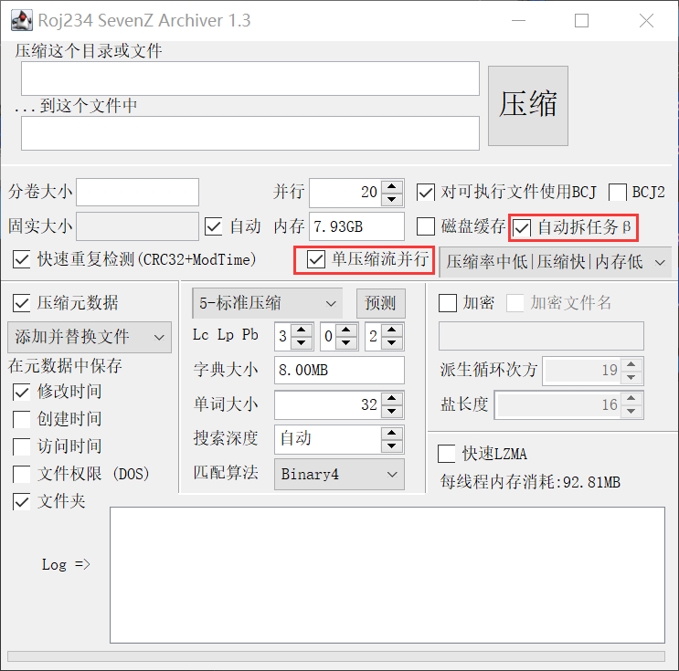

# 多线程高性能7z压缩和解压
* `roj.archive.qz.QZArchive`用于读取
* `roj.archive.qz.QZFileWriter`用于写入


* AES加密
* 分卷
* 固实
* 压缩文件头
* 并行压缩 / 解压
* 全新* 的并行压缩方式！既支持文件级别的并行压缩，又支持单个文件的并行压缩（LZMA2 only）
* 支持BCJ2等复杂coder
* 追加修改(复制字块)
* 高性能（大量使用Unsafe，请注意线程安全）
* 2024/01/14实测: 电脑为13600K@5.1Ghz/3.9Ghz
*  * 对于比较好压缩的文件和7-zip一样快，否则会慢一些，仅有80%左右
*  * 但是7-zip有时候跑不满CPU，这种情况性能再好又有什么用呢

LZMA2Input/OutputStream均支持并行压缩和解压  
2023/12/22: 支持在压缩时动态修改prop byte(仅支持单线程下)

### 可以先试试这个类 `roj.archive.ui.QZArchiverUI`
    如果选择【自动固实大小】建议同时勾选图中红框部分提高核心利用率
    其余选项基本在7-zip的文档中都有介绍，我不在赘述

### 示例

```java
package roj.archive.qz;

import roj.collect.MyHashMap;
import roj.concurrent.TaskPool;
import roj.ui.EasyProgressBar;
import roj.util.Helpers;

public class QZUtils {
	public static void readTest() throws Exception {
		TaskPool pool = TaskPool.Common();
		try (QZArchive archive = new QZArchive("D:\\Test.7z")) {
			// 这是最常用的。通过文件名获取entry
			MyHashMap<String, QZEntry> byName = archive.getEntries();
			// 通过这个可以多线程读取同一个压缩包，archive关闭时它也会同时关闭
			try (QZReader asyncReader = archive.parallel()) {
				// 读取一个文件
				InputStream input = asyncReader.getInput(byName.get("plain.txt"));
				if (input != null) input.close();

				// 密码并非必选，还可以在构造器中指定String或byte为密码
				// 这个方法存在的目的是因为虽然GUI不行，但是文件格式允许不同文件不同密码
				input = asyncReader.getInput(byName.get("crypt.txt"), "12345".getBytes(StandardCharsets.UTF_16LE));
				if (input != null) input.close();
			}

			// 按文件在压缩文件中的排列顺序读取
			// 在这种for循环中检测entry并解压比起随机访问会快一些
			for (QZEntry entry : archive.getEntriesByPresentOrder()) {
				bar.addMax(entry.getSize());
			}

			// 而如果仅仅只是读取所有文件可以直接用这个方法
			archive.parallelDecompress(pool, (entry, in) -> {
				try {
					in.skip(999999999999L);
				} catch (IOException e) {
					// 由于我用了BiConsumer，所以如果想要丢异常只能这样
					// 但是即便丢出去，外面也不会处理，会给线程池的exceptionHandler处理
					Helpers.athrow(e);
				}
			}, null);

			pool.awaitFinish();

			// 这样就可以在压缩文件之后追加文件了 (当然archive也不能关闭)
			// 使用起来和new一个没有区别
			QZFileWriter appender = archive.append();

			// 这是单线程的使用方式
			// 先设置压缩方式，和固实大小（0和-1有特殊语义）
			appender.setCodec(new LZMA2());
			appender.setSolidSize(1919810);

			// 当然只有名称也许不够，还可以设置一下三个修改时间和文件属性
			appender.beginEntry(new QZEntry("aweawe"));
			// 这是OutputStream
			appender.write(new byte[10248]);
			appender.closeEntry();

			// 多线程
			try (QZWriter out = appender.parallel()) {
				// 使用方式同上，但是内存缓存，在close时提交给父亲
				// 或者也可以appender.parallel(Source)为它指定一个磁盘缓存

				// 如果交给别的类，你可能需要让它忽略close()
				// out.setIgnoreClose(true);
			}

			// 设置文件头的压缩算法和方式
			// 算法并非必须设定，不设定则是上面几行设置的单独LZMA2
			appender.setCodec(new LZMA2(), new QzAES("12345"));
			appender.setCompressHeader(1);
			
			// close时也会自动finish
			appender.finish();
		}

	}
}

```

## 什么，你说的并行压缩/解压就这？
LZMA2有构造器支持LZMA2Options做参数  
先new Options然后调用setAsyncMode()就可以在流内部并行压缩/解压了  
当然，你也可以单独使用LZMA2Options来读写文件

* `QZArchive`**不支持**流级别的并行解压
* `QZFileWriter`支持流级别的并行压缩
```java
class LZMA2Options {
	/**
	 * <pre>启用对于单独压缩流的多线程压缩模式
	 * <b>注意，对比{@link roj.archive.qz.QZFileWriter#parallel()}的不同文件并行模式,单压缩流并行会损失千分之一左右压缩率</b>
	 * @param blockSize 任务按照该大小分块并行，设置为-1来自动选择(不推荐自动选择)
	 * @param executor 线程池
	 * @param affinity 最大并行任务数量 (1-255)
	 * @param dictMode 任务的词典处理模式，设置为-1来自动选择(不推荐自动选择)
	 * <pre>{@link #ASYNC_DICT_NONE} 每个块重置词典, 速度快, 压缩率差, 内存占用小 (7-zip的默认模式) (支持并行解压)
	 * {@link #ASYNC_DICT_SET} 在write的调用线程上设置词典, 速度慢, 压缩率好, 内存占用中等
	 * {@link #ASYNC_DICT_ASYNCSET} 在异步任务线程上设置词典, 速度中等, 压缩率好, 内存大
	 */
	public void setAsyncMode(int blockSize, TaskHandler executor, int affinity, int dictMode) {
		if (blockSize != 0 && blockSize < ASYNC_BLOCK_SIZE_MIN || blockSize > ASYNC_BLOCK_SIZE_MAX) throw new IllegalArgumentException("无效的分块大小 "+blockSize);
		if (affinity != 0 && affinity < 2 || affinity > 255) throw new IllegalArgumentException("无效的并行任务数量 "+affinity);
		if (dictMode < 0 || dictMode > ASYNC_DICT_ASYNCSET) throw new IllegalArgumentException("无效的词典处理模式 "+dictMode);
		asyncBlockSize = blockSize;
		asyncExecutor = executor;
		asyncAffinity = (byte) affinity;
		asyncDictMode = (byte) dictMode;
	}
}
```