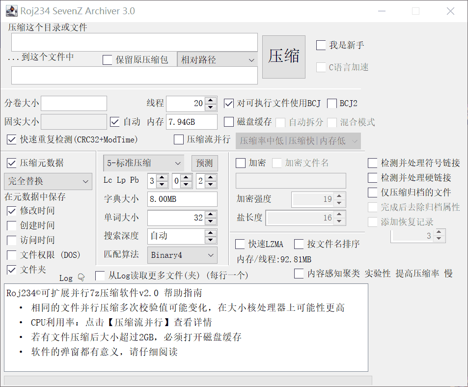

# 7z-archive v3.1：高性能Java 7z压缩与解压

`roj.archive.qz` 模块提供了一套用于处理 7z 档案的强大工具，旨在实现多线程、高性能的压缩和解压操作。

*   **读取 7z 档案：** 使用 `roj.archive.qz.QZArchive`
*   **写入 7z 档案：** 使用 `roj.archive.qz.QZFileWriter`

## 🌟 主要特性

*   **AES 加密支持：** 保护您的数据安全。
*   **分卷支持：** 处理大型文件和存储限制。
*   **固实压缩：** 优化存储空间。
*   **压缩文件头：** 提供更小的文件大小并保护元数据。
*   **革命性的并行处理能力：**
    *   **文件级别并行压缩/解压：** 同时压缩多个文件。
    *   **单文件并行压缩（LZMA2 only）：** 大幅提升单个大文件处理速度。
*   **高级编码器支持 (2023 年)：** 是 Java 中唯一支持 BCJ2 等复杂编码器的实现。
*   **追加修改与块复制：** 灵活地修改和更新现有档案。
*   **极致性能：** 大量使用 `Unsafe` 类进行底层优化，在追求性能的同时请注意线程安全。
*   **LZMA2 错误恢复 (2025/10/11)：** 独家支持在LZMA2固实压缩数据流中进行错误恢复，极大地增强了数据完整性。
    *   注意：基于LZMA State Reset Chunk，这个功能并不是设计用于错误恢复，而是提高压缩率
    *   一旦进行错误恢复，必然丢弃部分数据，可能和其他解压工具一样丢失所有数据
    *   例如，本模块压缩的数据流因为未生成该chunk，理论上无法错误恢复，但这种数据流依然符合规范

## 🚀 性能基准 (2024/01/14 实测)

测试环境：13600K@5.1Ghz/3.9Ghz

*   **单核性能：** 达到 7-zip 的 50% 到 100%。
*   **核心利用率：** 更高，在某些场景下速度 **明显超越 7-zip**。
*   **挑战极限：** 以 Java 之躯，比肩原生！

## ✨ 并行压缩与解压的深度探索

本模块对 LZMA2 的并行处理进行了深入优化，提供了多层次的并行能力。

*   `LZMA2Input`/`OutputStream` 均支持并行压缩和解压。
*   2023/12/22 更新：支持在压缩时动态修改 `prop byte` (限单线程)。

### 文件级别并行 Vs. 流级别并行

*   `QZArchive` 支持 **流级别的并行解压**。  
    该功能目前还在测试，可能导致解压失败，并非production-ready
    ```java
    for (WordBlock block : archive.getWordBlocks()) {
        LZMA2 codec = block.getCodec(LZMA2.class);
        if (codec != null) {
            // 注意：不能与错误恢复功能同时使用
            codec.setDecompressionMode(LZMA2.PARALLEL_DECOMPRESS);
        }
    }
    ```
*   `QZFileWriter` 支持 **流级别的并行压缩**。
```java
    class LZMA2Options {
        /**
         * <pre>启用对于单独压缩流的多线程压缩模式
         * <b>注意，对比{@link roj.archive.qz.QZFileWriter#newParallelWriter()}的不同文件并行模式,单压缩流并行会损失千分之一左右压缩率</b>
         * @param blockSize 任务按照该大小分块并行，设置为-1来自动选择(不推荐自动选择)
         * @param executor 线程池
         * @param affinity 最大并行任务数量 (1-255)
         * @param noContext 每个块是否重置词典 <br>
         * {@code true} 每个块重置词典, 速度快, 压缩率差 (支持并行解压) <br>
         * {@code false} 异步设置词典, 速度慢, 压缩率好
         */
        public void setAsyncMode(int blockSize, Executor executor, int affinity, boolean noContext) {
            asyncExecutor = executor;
            asyncMan = new LZMA2ParallelManager(this, blockSize, noContext, affinity);
        }
    }
```

## 🖥 快速预览：图形用户界面

建议通过类 `roj.gui.impl.QZArchiverUI` 尝试本模块的强大功能。



GUI 中的具体选项（如“添加并替换文件”、“更新并添加文件”等）请查阅 `QZArchiver` 的源代码，其设计可能与 7-zip 的默认行为有所不同。

## 💡 示例代码

```java
package roj.archive.qz;

import roj.collect.HashMap;
import roj.concurrent.TaskPool;
import roj.concurrent.TaskGroup;
import roj.util.Helpers;

import java.io.IOException;
import java.io.InputStream;
import java.nio.charset.StandardCharsets;

public class QZUtils {
    public static void readAndWriteExample() throws Exception {
        TaskPool pool = TaskPool.common();
        try (QZArchive archive = new QZArchive("D:\\Test.7z")) {
            // --- 读取操作示例 ---

            // 通过文件名获取 entry (最常用)
            HashMap<String, QZEntry> byName = archive.getEntries();

            // 多线程读取：通过 forkReader() 获取独立的读取器，archive 关闭时它也会自动关闭
            try (QZReader asyncReader = archive.forkReader()) {
                // 读取普通文件
                InputStream input = asyncReader.getInput(byName.get("plain.txt"));
                if (input != null) input.close();

                // 读取加密文件：密码可为 null 以使用打开压缩文件时的密码。
                // (注意：文件格式规范允许不同文件使用不同密码，即使 GUI 不支持)
                input = asyncReader.getInput(byName.get("crypt.txt"), "12345".getBytes(StandardCharsets.UTF_16LE));
                if (input != null) input.close();
            }

            // 按文件在压缩包中的排列顺序读取 (顺序读取通常比随机访问更快)
            // for (QZEntry entry : archive.getEntriesByPresentOrder()) {
            //     bar.addMax(entry.getSize());
            // }

            // 启用错误恢复模式 (LZMA2 only)
            for (WordBlock block : archive.getWordBlocks()) {
                LZMA2 codec = block.getCodec(LZMA2.class);
                if (codec != null) {
                    codec.setDecompressionMode(LZMA2.ERROR_RECOVERY);
                }
            }

            // 并行解压所有文件
            TaskGroup group = pool.newGroup();
            archive.parallelDecompress(group, (entry, in) -> {
                try {
                    // 示例：跳过文件内容
                    in.skip(999999999999L);
                } catch (IOException e) {
                    // 在 BiConsumer 中抛出的异常会被 TaskGroup 捕获，并在下方的 await 中抛出
                    Helpers.athrow(e);
                }
            }, null);
            group.await(); // 等待所有解压任务完成

            // --- 写入/追加操作示例 ---

            // 追加文件到现有档案 (archive 必须保持打开)
            QZFileWriter appender = archive.append();

            // 配置单线程写入：设置压缩方式和固实块大小 (0 和 -1 有特殊语义，请查阅 Javadoc)
            appender.setCodec(new LZMA2());
            appender.setSolidSize(1919810);

            // 添加单个文件
            appender.beginEntry(QZEntry.of("aweawe")); // 也可以通过 QZEntry 其他方法设置修改时间、文件属性等
            appender.write(new byte[10248]); // 写入文件内容
            appender.closeEntry();

            // 多线程写入：使用并行写入器
            try (QZWriter out = appender.newParallelWriter()) {
                // 使用方式与单线程写入类似，但数据会先缓存到内存
                // 在 out.close() 时提交到父写入器
                // 也可以通过 appender.newParallelWriter(Source) 指定磁盘缓存
                // 如果需要将此写入器传递给其他类，可以考虑调用 out.setIgnoreClose(true); 来避免意外关闭。
            }

            // 设置文件头的压缩算法和方式
            // 如果不设置，则使用前面设置的文件 entry 默认值
            appender.setCodec(new LZMA2(), new QzAES("12345"));
            appender.setCompressHeader(1);

            // 完成写入操作 (close 时会自动 finish)
            appender.finish();
        }
    }
}
```