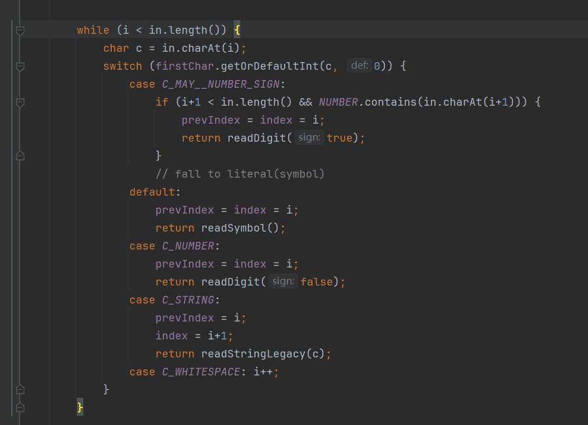
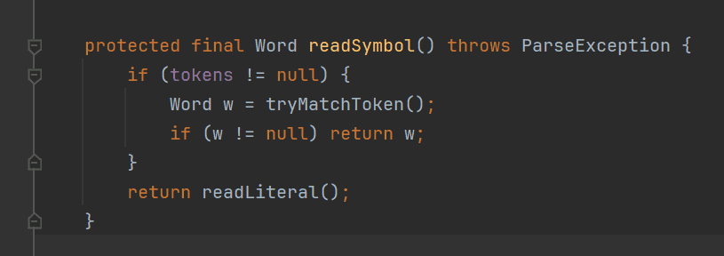
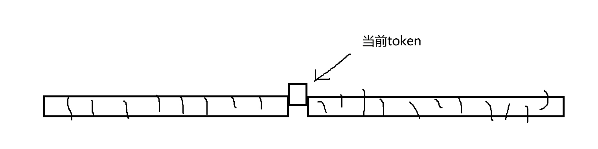
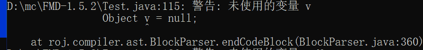
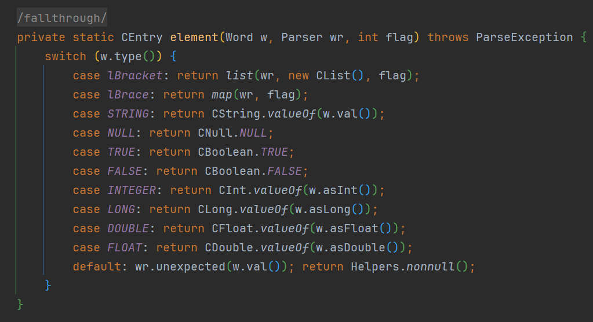
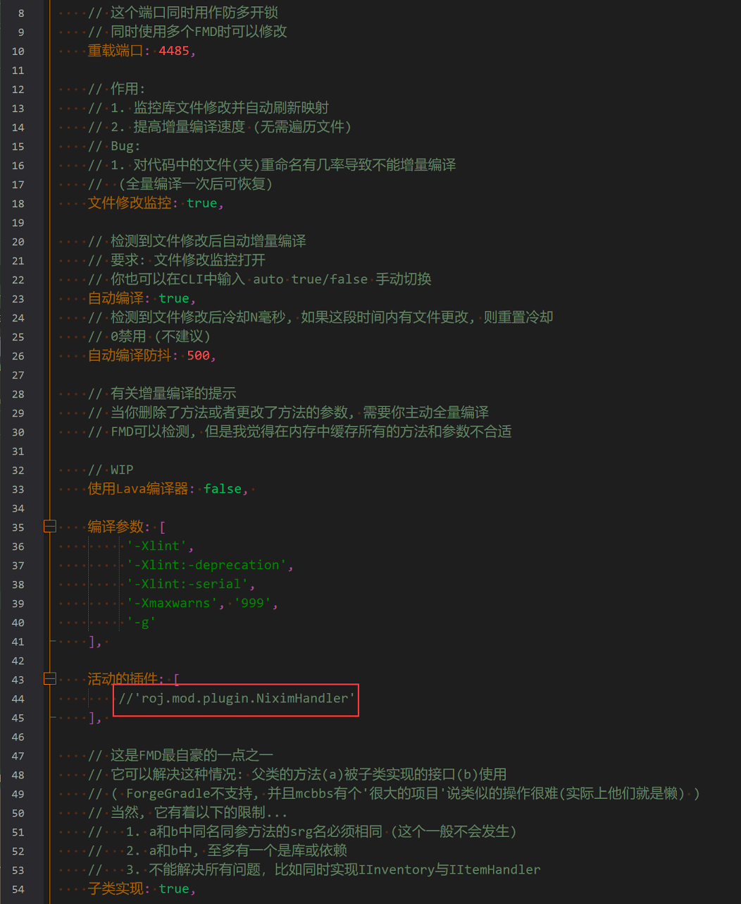
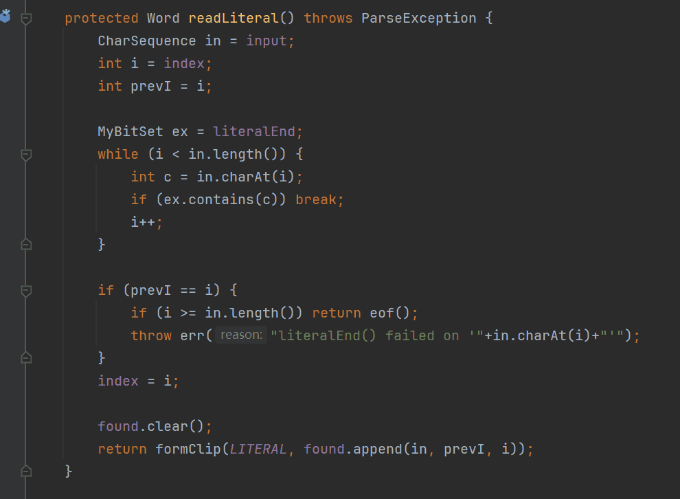

## JSON解析器
改编自我和群友的聊天记录，对方已同意  
不过大概也许你们都看不懂吧（（（
### Tokenizer at 2024年6月29日 3:04:20

ME:  
JSON解析器  
这很重要  
你可以先设计一个能解析JSON文本的解析器  
JSON很简单，比起其它的格式，比如XML YAML TOML都简单  
不过在设计过程中，一定要注意抽象思维，因为你的真实目的不是设计JSON解析器，而是它背后的东西，词法分析器  
 * 当时我并没有这个概念，直接叫Parser
<pre>
R:
json语法简单说不定可以
咱们现场就讲思路
有一个字符位置指针  
从第0个char开始，然后一个个往右移  
以面向对象的思路，那就是在什么时候实例化哪种对象，然后在什么时候close某个对象属性的读取等等，然后指针走到头就结束  
以状态机的思路，那就是根据读的情况配置状态机再根据状态机的状态去更新什么member之类的  
lexer之类的话，因为我缺少相应课程，所以我提到了书（  
这是非科班出身写底层的劣势，我只会看文档  
</pre>
#### readToken
我们首先来看，对每个字符我选择分析它的类型，
- 如果是“空格，\t \r \n”那么就跳到下一个字符
- 如果是双引号，那么开始解析转义字符串
- - 很简单，碰到\那么下一个字符处理转义，否则碰到"就结束  
  - 双引号也有一个tokenId，代指所有的转义字符串
- 如果是0-9，解析不带符号的数字
- 如果是加号或减号，看一看下一个字符是不是0-9，是的话，解析带符号的数字
- 其他情况，解析“符号”（我自己的说法）

`需要注意的是，数字的解析和转义字符串并不简单，不过我们先忽略细节`



#### readSymbol

我们看一下*tryMatchToken*函数，
（为什么这么设计，性能，别多问了……）  
它从当前位置(*index*)开始匹配，检查有完全匹配的特殊字符
- （I类 不可变）是 {} [] : , true false null 等，给它们分配一个tokenId，并返回
- （II类 可变，固定前缀）是//, /*等注释开始符，那么从这里开始处理注释
- 否则返回null

再看一下*readLiteral*，现在我们假设它只是**抛出异常**：未预料的字符
<pre>
R: 这个tokenId是啥，看起来很像class啊  
ME: short id  
    为啥用short，因为省空间，并且可以用负数表示非词法错误，并且用不完  
    - java的tokenId足够用完byte  
R: 虽然不太明白使用这个概念的意义，不过模拟运行已经成功了  
   那这样会得到一组映射   
   token[token_id] -> 对应范围内的文本的值  
   然后把char指针换成token指针，那也可以，效果一样的  
ME: 并不是一定要解析成列表，不过这样开始也没问题
</pre>
#### Word(Token)
接下来我们把tokenId包装成一个类  
如果遇到转义字符串、数字，也应该同时返回他们的内容  
如果已经到输入字符串的末尾，那么返回EOF，EOF也有一个tokenId（-1）  
```java
abstract class Token {
  public readonly short id;
  public readonly int position;
  public abstract String stringValue();
  //以及intValue longValue floatValue和doubleValue
  //stringValue方法必须实现，且比如null和[和转义字符串的都是StringToken
  //IntToken除了stringValue还实现intValue，其它数字类型包装相同
}
```
其下有StringToken IntToken LongToken FloatToken DoubleToken
#### Tokenizer
然后再把之前提到的函数封装一下，对外暴露两个函数  
void init(String s);  
Token readToken();  
为了提示词法级别的错误，比如直接发现了未转义的字符串  
或者非法的数字格式，非法的转义  
Token readToken() throws ParseException;  
#### 检测-回退
- 为什么需要回退？
- 举例子：java的括号有三种语义  
  (type) expr 类型转换  
  (a, b, c) -> lambda表达式  
  (expr) [operator] expr 表达式
- 那么当你碰到一个左圆括号就不能像JSON一样直接解析了  
  你要不断去读取token，直到确定它符合某种类型，然后再把读取过的token放回去，再调用对应的解析方法

为了实现检测-回退，我们新建List<Token> savedToken和这几个方法
```java
public class Scanner implements Lexer {
    private final Tokenizer tokenizer;
    private Token token;
    private final List<Token> savedTokens = new ArrayList<>();

    public Token token() {return token = nextToken();}

    public Token token(int lookahead) {
        if (lookahead == 0)
			return token == null ? token = nextToken() : token;
        ensureLookahead(lookahead);
        return savedTokens.get(lookahead - 1);
    }

    private void ensureLookahead(int lookahead) {
        for (int i = savedTokens.size() ; i < lookahead ; i++) {
            savedTokens.add(tokenizer.readToken());
        }
    }

    private Token nextToken() {
        return !savedTokens.isEmpty() ? savedTokens.remove(0) : tokenizer.readToken();
    }
}
```
（仅用于简化原理，不适合实际运行）  
这样，当你普通的读取Token时，相当于调用token()  
而当你遇到左括号需要分支跟踪时，就调用token(int)，这个int从0开始，由分支跟踪代码递增  
<pre>
R: 对于branching token，那么可以用一个栈来存当前已建立的分支，然后如果遇到需要回退的情况，就把后面的丢掉然后退到最后一个branching token的位置，并用新的path重试
   
   也许不用代码的描述似乎更好理解？
ME: 你假设整个字符串已经全部解析成token了，那就是这样
    实际上不会一开始就全部解析，而是在字符串上不断前进
    这主要是为了节省空间，同时也能适配Java的Reader模式
    如果你把token当成一个列表，那确实就是index回退
R: 对于json这种没有歧义的情况，不需要跟踪branch，那么只需要跟踪最后正在处理的token在哪，（如果此token有记录对应的字符索引），然后抛出异常的时候就把这个index拿出来就可以了
   
   还是太关注优化了
   难怪这么非线性
ME: 是的
R: 明明可以直接把token一把存着，这样思路就清晰了许多
ME: ……这就是设计和实现啊.jpg
R: 如果说是往saveTokens里也渐进式的往里面填token，那我就理解了
   我自己的想法是，源文件是线性的，解析出来token也是线性的
   因此如果需要跟踪索引，在token全部被存着的前提下，就像这张图所述

   左边的列表存着解析完的token，右边的列表存着没解析的token，然后只需要对当前token做处理，之后把它甩到左边的列表机可


R: 如果我们在第1000个token抛异常，我们希望返回什么？
ME: 抛异常就往上抛
R: 是说
   malformed JSON at position 6666, char"]"
   还是别的什么
ME: 差不多是
ME: 我的异常需要index作为参数，无论来自*readToken*中见到的字段*index*还是Token
    index是对字符串中字符的索引
    同时也需要字符串作为参数，不过这是可选的（因为有可能是Reader） 
    抛出异常在打印stackTrace的时候根据index定位到字符串的行和列，方便调试，就像这样
    
   （实现上不一定是抛异常）
</pre>
### JSON Parser
这回我直接上代码了

```java
public CEntry element(int flag) throws ParseException { return element(token(), this, flag); }
```
主要流程就是读取一个token，然后根据类型走不同的分支  
如果是不能有【后续元素】的类型，比如整数，字符串等，直接当地解决  
否则是列表或映射，再单独解析  
否则抛出异常  

需要注意的是
- TRUE FALSE NULL
- STRING INTEGER LONG DOUBLE FLOAT
- 它们不是同一类东西
- 前三个的意义是确定的，而后五个有着无限的可能，在代码中也能看到

先从简单的开始，列表  
首先，'['这个token我们读取过了
- 然后调用element，获取列表中第一个元素，并且把它加入图中那个CList  
- 最后读取一个token
- - 如果是逗号就重复上述过程  
- - 如果是]就终止循环  
- - 如果都不是就抛出异常（比如EOF）

然后是映射  
同样，'{'也被读取了  

首先读取一个token，它必须是转义字符串类型，这是映射的*键*
- 把它的stringValue暂存，String key
- 假设你的token都在一个列表里，暂存并不是必须的，我这是因为优化

然后再读取一个token，它必须是':'  
之后调用element读取*值*  
把这个键和值的映射存入CMapping中  

下一个token如果是逗号……如果是}……如果都不是……
<pre>
R: json映射是啥，没用过啊，让我查查
ME: 啊？就是mapping啊
    {"k":"v"}
R: 淦，我都不知道这叫映射
</pre>
好了，现在你有一个JSON解析器了，但是它不支持JSON5标准，也不满足你所期望的“配置文件”格式  
让我们来给它增加功能
#### 尾逗号
JSON5支持尾逗号  
比如 [5,] 是合法的JSON5
<pre>
R: 这个简单嘛，加个if
   在逗号之后检索下一个元素的时候如果读到]，那么返回并关闭本list
ME: ...

R: 前面两个没问题
ME: 没问题？这代码都不能运行的
    你再想想，如果严格按照我写的流程，它是不是会对空列表和空映射报异常？
R: 好像调用element（我已经不知道element是啥了，超出上下文窗口）
   
   的时候，如果拿到奇怪的东西会抛异常
   比如}不是element应当拿到的
ME: 是的
</pre>

来看看list支持尾逗号的版本  
```javascript
var hasComma = true;
for(;;) {
   var token = token();
   if (token is ']') break
   if (token is ',') {
      if (hasComma) throw "连续的逗号"
      hasComma = true
   } else {
     if (!hasComma) throw "缺失逗号"
     hasComma = false
     var element = element()
   }
}
```
尾逗号在哪里支持的？  
break的时候没有检测hasComma的真假  
map的版本大同小异  
#### 注释
JSON5支持使用//和/*来表示单行和多行的注释  
<pre>
ME: 你打算怎么做
R: 3点53啦
ME: 那我继续说得了

R: 如果是前面的char指针，当然是读到对应字符时候直接跳

   至于tokenizer，那么会在读到注释开始的token时
   如果是单行注释，那么loop到下一个换行符
   如果是多行，那么按窗口搜索到下一个注释close的部分
ME: 可我的要求是，能被解析（
      个人原因：我还有配置文件序列化，能保存注释是个加分项
      Javadoc也是一种注释

R: 如果需要仍然保留其内容，那么……会有两种思路
   如果不在意按原样保留位置，那么可以定义一个元素的所属注释
   然后在下一次写回的时候，在转回纯文本的过程中，将注释渲染到指定位置

   如果原样保留（比如在特定元素的前面或后面，使用哪种符号做注释），那么问题就比较麻烦了，我先不想

ME: 是的，我是用的元素的所属
    我的目标也只是不丢就够了
</pre>
注释它不会有tokenId，因为注释可以在任意地方，但是能保留注释的元素不在任意地方  
所以我们简单点，只有在列表和映射的元素之前才能添加注释  
在这之外的注释会被忽略，而不是抛出异常  
比如这些注释是能被解析的，然而红圈中的会被忽略  

方案也很简单，在Tokenizer中新增一个字段，CharList/StringBuilder comment  
如果它是null，那么直接跳，否则把注释的内容追加进这里面  
然后在list的element调用之前，以及map的key读取前，把它设置为非空，读取后检查一下  
@see Tokenizer
<pre>
R: 你这个key怎么没有引号
ME: 这是我们要实现的功能啊
R: 好怪的需求
ME: (往回指了指firstChar和readLiteral)
R: 彳亍，这也太不常规了


R: 接前面对于缺失逗号的情况，如果从原始文本来看的话，非常可能是带【空格】的单词，如果是我，说不定就把元素粘一起了
ME: 粘一起？
R: 原始文本
   ["1", 2, 3 4, "a" "b", "c", "d",]
ME: 我的parser在这个时候会报错啊
    在遇到【其它】的时候，hasComma不能为false
R: (没看到我说的话)
   如果用tokenizer的做法，那么如果不做特殊处理应该会输出ab
   如果对后续token的类型做限制，那么就报错
ME: 你看这里，碰到双引号"C_STRING"直接return了
    
    考虑到我之前的流程，他只会返回类型为转义字符串内容为a
    下一次是转义字符串内容为b
R: 从你的代码来说确实是这样
   好像没有更多问题了
</pre>
#### Literal
接下来是最后一个功能，这不属于JSON5范围  
这也是重要的一部分，之前一直被忽略的*readLiteral*函数终于要登场了  
我们的Tokenizer到现在还没考虑literal的问题呢  

我希望raw string（别名literal，字面量等）也能做key，就像这样  
literal我也不知道怎么称呼，从这里挑个你喜欢的，或者随便  


这是readLiteral，也就是不断读取字符，直到文件结尾，或者某个字符属于“literalEnd”  
如果读取了0个字符，那么抛出异常  
literalEnd里面是 { } [ ] : , 以及空白字符  
R:   

如果去掉空白字符，那么 [a b, c d e f]会解析为["a b", "c d e f"]
去除空白字符对于错误解析影响不大，因为键名后面必须有冒号，列表值后面必须有逗号  
而它们都在literalEnd中  
我加着，仅仅是个人喜好  

接下来，我们给LITERAL分配一个id  
最后，我们修改一下*映射*的解析代码  
`首先读取一个token，它必须是转义字符串类型，这是映射的*键*`  
现在，它不再必须是转义字符串了，它也可以是LITERAL  

### 4:24:27
好了吗？  
下课了。  
第一章已经结束  
现在，你可以抽空去做这个“加料版”的JSON解析器，最好是使用Java，不过其他语言也可以，我不强求